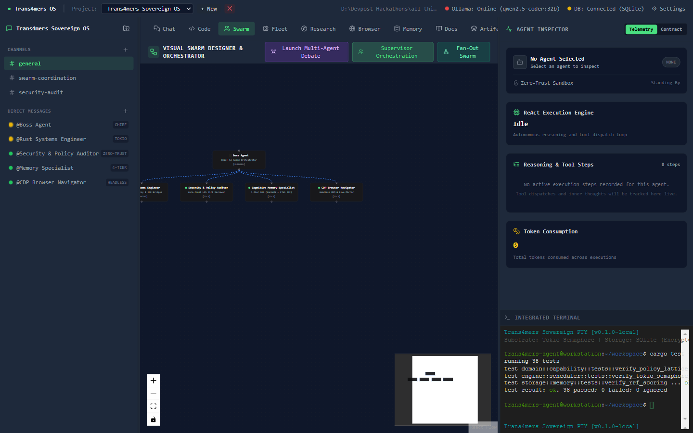
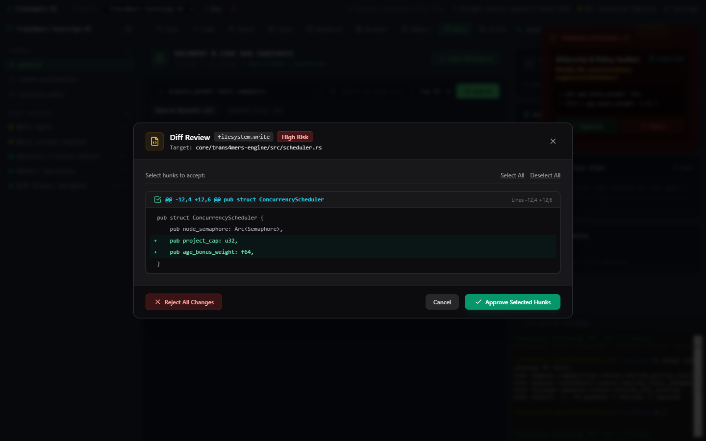
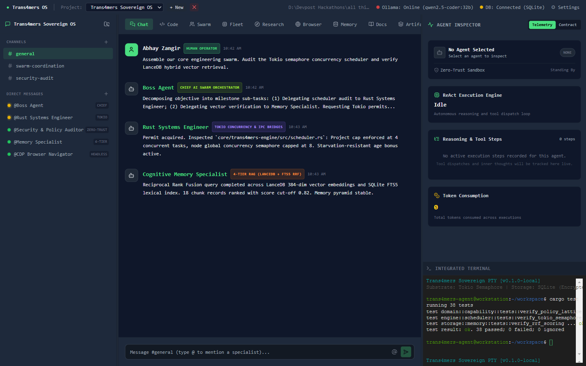
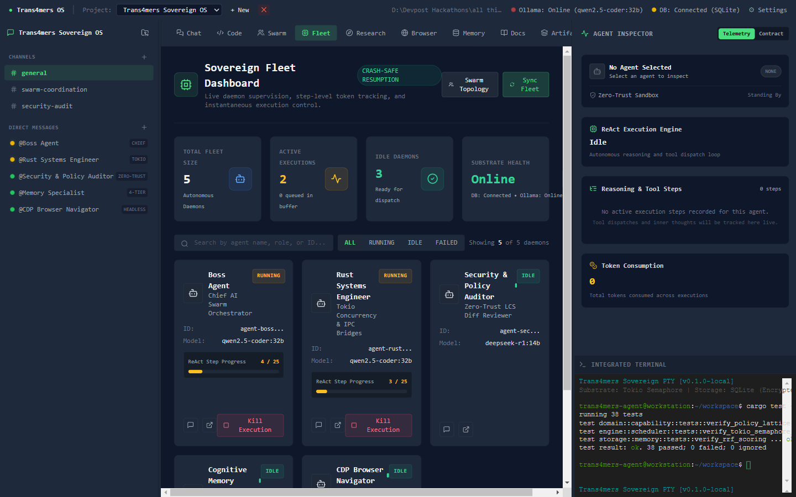
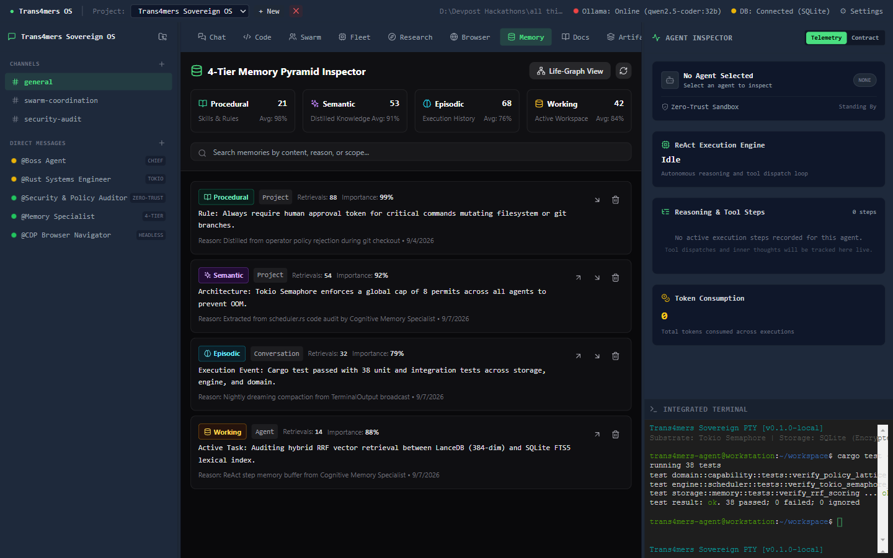
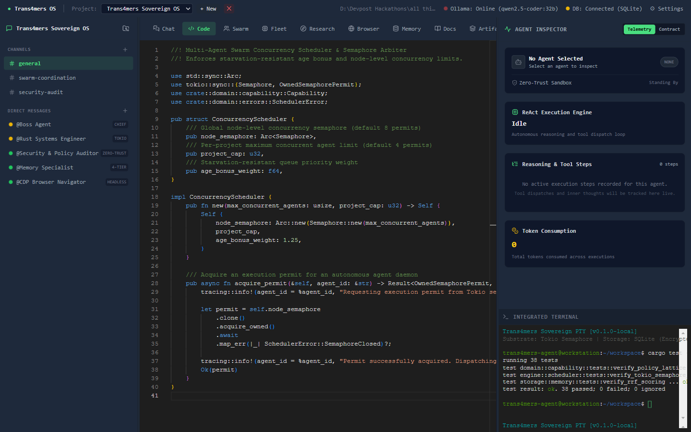
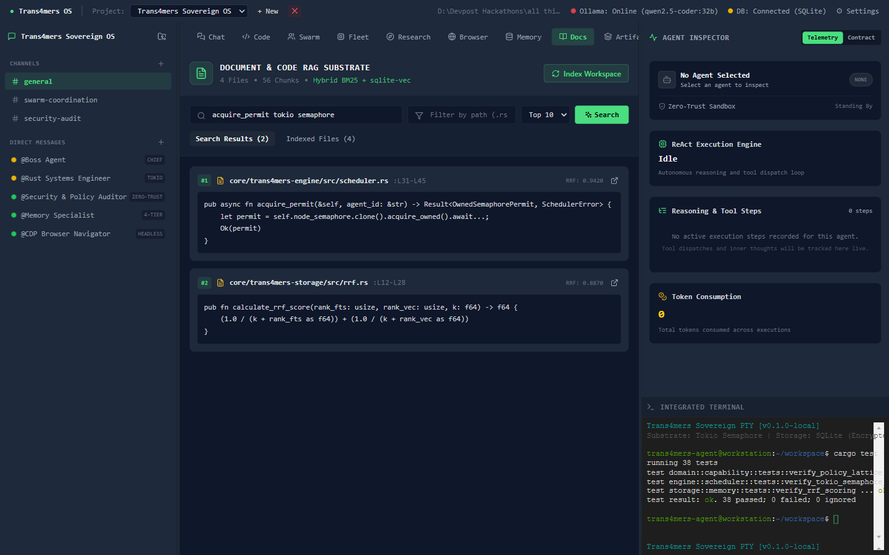
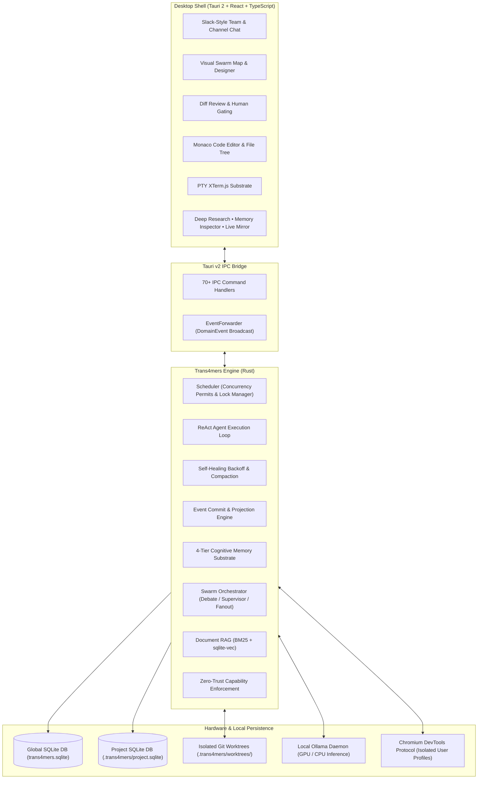

# Trans4mers: Sovereign Multi-Agent Desktop Operating System

<p align="center">
  
</p>

<p align="center">
  <a href="https://github.com/abhayzangir1/trans4mer/actions/workflows/ci.yml"></a>
  <a href="https://github.com/abhayzangir1/trans4mer/releases"></a>
  
  
  
  
  
  <a href="LICENSE"></a>
</p>

<p align="center">
  <strong>Local, event-sourced multi-agent desktop application running on your workstation.</strong>
</p>

<p align="center">
  <a href="#quick-start--one-click-install">Quick Start</a> •
  <a href="#product-screenshots">Screenshots</a> •
  <a href="#core-capabilities">Capabilities</a> •
  <a href="#architecture">Architecture</a> •
  <a href="#subsystem-deep-dives">Subsystems</a> •
  <a href="#model-setup">Models</a> •
  <a href="#benchmarks--footprint">Benchmarks</a> •
  <a href="#codebase-structure">Structure</a> •
  <a href="#documentation">Docs</a>
</p>

---

## Overview

Trans4mers is a local desktop application for running autonomous agent swarms on your own computer. It combines an asynchronous Rust engine with local Ollama inference, an embedded SQLite database using `sqlite-vec`, and a native Tauri v2 desktop shell.

Every state transition writes to an append-only event log before updating database tables. If the application gets terminated mid-task, the engine reads the log on next startup, replays pending events, and picks up where it stopped. Dangerous actions like writing files outside scratch, executing shell commands, or changing database rules pause for operator review.

> [!WARNING]
> **Project Status & Security Notice (Solo Student Developer • Alpha Project):**  
> Trans4mers is an early-stage, active work-in-progress research and learning project built by a solo student developer. While it implements a zero-trust capability lattice, anti-TOCTOU argument hashing, and Myers LCS diff review gating, **it has not undergone independent external third-party commercial security audits, nor has it been battle-tested across thousands of production environments.**  
>  
> Because this software executes shell commands and writes files directly to your workstation, **there may be undiscovered edge cases, minor to critical bugs, or unexpected behavior.** Always exercise strict operator caution with autonomous shell execution: carefully inspect proposed agent actions in the Human-in-the-Loop Diff Panel before approving, and test within sandboxed, containerized, or backed-up directories. Feedback, bug reports, and pull requests from experienced developers are warmly welcomed!

---

## Product Screenshots & System Interface <a id="product-screenshots"></a>

<table>
  <tr>
    <td width="50%" valign="top">
      <h3 align="center">Real-Time Swarm Topology & Designer</h3>
      <a href="assets/screenshots/02_local_swarm_designer.png"></a>
      <p align="center"><i>Visualizing hierarchical task delegation, running workers, and active state transitions in an interactive ReactFlow DAG.</i></p>
    </td>
    <td width="50%" valign="top">
      <h3 align="center">Zero-Trust Human Approval & LCS Diff</h3>
      <a href="assets/screenshots/07_local_hitl_approval_diff.png"></a>
      <p align="center"><i>Deterministic policy gating: destructive terminal commands and code modifications halt for hunk-level operator authorization.</i></p>
    </td>
  </tr>
  <tr>
    <td width="50%" valign="top">
      <h3 align="center">Slack-Style Blackboard & Native Terminal</h3>
      <a href="assets/screenshots/01_local_chat_blackboard.png"></a>
      <p align="center"><i>Specialized agent teams collaborating via shared pub/sub channels, consensus blackboards, and live duplex PTY sessions.</i></p>
    </td>
    <td width="50%" valign="top">
      <h3 align="center">Sovereign Fleet Concurrency Dashboard</h3>
      <a href="assets/screenshots/03_local_fleet_dashboard.png"></a>
      <p align="center"><i>Tokio Semaphore permit tracking, live daemon supervision, and crash-safe ReAct step counters across active workers.</i></p>
    </td>
  </tr>
  <tr>
    <td width="50%" valign="top">
      <h3 align="center">4-Tier Cognitive Memory Pyramid</h3>
      <a href="assets/screenshots/04_local_memory_inspector.png"></a>
      <p align="center"><i>Working, Episodic, Semantic, and Procedural memory tiers indexed with SQLite FTS5 BM25 and dense vector similarity.</i></p>
    </td>
    <td width="50%" valign="top">
      <h3 align="center">Sandboxed Monaco Code Editor & IDE</h3>
      <a href="assets/screenshots/05_local_monaco_editor.png"></a>
      <p align="center"><i>Agents write and refactor code directly on disk with live Monaco editor inspection and zero-scope filesystem protection.</i></p>
    </td>
  </tr>
  <tr>
    <td colspan="2" valign="top">
      <h3 align="center">Hybrid BM25 + Vector Document RAG Substrate</h3>
      <a href="assets/screenshots/06_local_document_rag.png"></a>
      <p align="center"><i>Local codebase and documentation indexing via Reciprocal Rank Fusion (RRF) combining SQLite FTS5 lexical ranking and dense vector embeddings.</i></p>
    </td>
  </tr>
</table>

---

## Quick Start & One-Click Install

### 1. Launch with Helper Script (Windows)

Clone the repository and run the automated startup script:

```bat
git clone https://github.com/abhayzangir1/trans4mer.git
cd trans4mer
.\run-app.bat
```

The script checks if an Ollama daemon is active, starts the local Vite dev server on port 1420, and boots the native Tauri desktop shell.

---

### 2. Manual Development & Build

Alternatively, run or package the desktop application manually using Cargo and npm:

```bash
# 1. Install frontend dependencies
cd apps/desktop
npm install

# 2. Run in development mode (hot reloading)
cargo tauri dev

# 3. Build standalone native installer (NSIS on Windows, DMG on macOS, AppImage on Linux)
cargo tauri build
```

> **Note on CI Releases:** Pre-compiled binaries are generated via the automated GitHub Actions workflow (`.github/workflows/release.yml`) whenever a release tag (e.g., `v0.1.0`) is pushed to GitHub.

---

### 3. Model Engine: Local & Frontier BYOK <a id="model-setup"></a>

Trans4mers works with local inference endpoints as well as commercial APIs:

- Local Workstation Execution (Ollama): For private offline runs, connect to a local Ollama daemon. Large models such as `qwen2.5-coder:32b`, `deepseek-r1:32b`, or `llama3.3:70b` handle complex tool-calling and refactoring tasks without leaking data.
- Cloud BYOK: When a task needs larger frontier models, you can enter API keys for Anthropic, OpenAI, or Google in Settings. Keys are stored in the operating system credential store (Windows Credential Manager, macOS Keychain, or Linux Secret Service) and requests go directly to the provider endpoints.
- Per-Agent Model Routing: You can assign specific models to specific agent roles in the Swarm Designer. For example, a small local model can handle terminal commands while a larger model handles system design and code reviews.

---

## Core Capabilities

- All data and prompts stay on your workstation with zero external telemetry.
- State updates use event-sourced CQRS over SQLite, publishing domain events to the desktop interface over Tauri IPC.
- ReAct loops handle transient network errors with exponential backoff and prune context when tokens approach window limits.
- The Swarm Designer supports supervisor-worker hierarchies, two-agent adversarial debates, and parallel fan-out tasks.
- High-risk operations (modifying files, running shell scripts, external requests) generate unified diffs and pause for approval with canonical SHA-256 argument verification.
- Memory is split across four tiers (working, episodic, semantic, procedural) searched with SQLite FTS5 BM25 and dense vector similarity.
- Duplex terminal sessions run through `portable-pty` and display in an embedded `xterm.js` window.
- Browser automation controls sandboxed Chromium profiles using the Chrome DevTools Protocol, with point-in-time snapshot rollbacks.
- Document RAG parses repository files into chunks for hybrid lexical and vector search.
- Artifact panels let you read generated design docs and post inline comments that turn into agent tasks.
- Background workers support cron schedules and run a memory consolidation routine at 3:00 AM.
- The Model Context Protocol client handles both stdio and SSE connections, with an in-app traffic log and inspector window.

---

## Architecture

For complete technical specifications across all subsystems, read the [**Master System Architecture Specification (docs/ARCHITECTURE.md)**](docs/ARCHITECTURE.md).



---

## Subsystem Highlights

### 1. ReAct Runtime and Error Recovery
Each agent runs a Thought-Action-Observation loop. When an LLM inference fails due to context limits, rate throttling, or bad JSON formatting:
- The engine retries transient failures using exponential backoff with jitter.
- Context compaction summarizes older conversational turns while retaining learned rules and goals.
- If an endpoint fails repeatedly, the runtime falls back to secondary configured models.

### 2. Multi-Agent Swarms
You can assign agents specific roles (architect, engineer, security auditor, researcher):
- Adversarial Debate pairs a proponent and a critic across structured rounds to catch flaws before code gets written.
- Supervisor Orchestration lets a lead agent break down a goal into sequential milestones and assign them to workers.
- Parallel Fan-Out runs independent tasks across multiple workers concurrently and aggregates outputs.

### 3. Cognitive Memory Pyramid
Memory is organized into four levels based on lifespan and relevance:
1. Working memory: in-flight conversation turns and ephemeral notes.
2. Episodic memory: durable logs of finished tasks, tool outputs, and steps.
3. Semantic memory: extracted facts and codebase invariants indexed with dense vectors.
4. Procedural memory: learned constraints, bug fixes, and user preferences retained across sessions.

### 4. Diff Review and Approval Gates
Dangerous capabilities require human oversight:
- File edits, elevated terminal commands, and external network calls generate an ActionDiff.
- The agent yields its execution permit and waits for review in the Diff Review Panel.
- Operators can review unified diffs line-by-line, accept or reject individual hunks, and approve execution.

### 5. Browser Automation and Viewport Mirror
Agents can read web docs and test local web servers through Chrome DevTools Protocol:
- Browser sessions use isolated profile directories in `.trans4mers/browser_profiles/`.
- The Live Mirror tab renders DOM snapshots, status codes, and viewport state in the desktop interface.
- You can roll back browser session state using stored directory tree hashes.

### 6. Deep Research Engine
The research workflow breaks questions into sub-queries:
1. Plans search facets based on the prompt.
2. Searches the local codebase, memory tables, and web sources.
3. Collects citations with file paths and URLs.
4. Synthesizes findings into a Markdown report saved as an artifact.

---

## Visual Themes

The desktop interface includes four visual themes:

| Theme Variant | Preview | Accent Palette |
| :--- | :--- | :--- |
| **Neon Cyan (Default)** |  | `#06B6D4` Cyan / `#0F172A` Slate |
| **Crimson Red** |  | `#EF4444` Rose / `#18181B` Zinc |
| **Industrial Steel** |  | `#94A3B8` Slate / `#09090B` Pure Black |
| **Solar Yellow** |  | `#F59E0B` Amber / `#1C1917` Stone |

---

## Developer Workstation Measurements (Self-Reported) <a id="benchmarks--footprint"></a>

*Note: The following measurements were captured locally by the author on development hardware (Apple M-series, Intel Core i7 / AMD Ryzen 7, 16GB RAM) during local test runs. They represent author-reported observations under standard local testing conditions, not independent third-party verified benchmarks.*

| Metric | Measured Value | Standard Cloud Competitors |
| :--- | :--- | :--- |
| **Desktop App Idle RAM** | **~78 MB** | 400 MB - 1.2 GB (Electron-based) |
| **Database Transaction Latency** | **< 1.2 ms** (SQLite WAL) | 80 - 350 ms (Remote Cloud DB) |
| **Event Replay / Recovery Time** | **< 45 ms** | Minutes / Not supported |
| **Network Egress (Local Mode)** | **0 KB/s (Strict Zero)** | Continuous code/prompt egress |
| **Concurrency Ceiling** | **8 Concurrent Agents** (Configurable) | Rate-limited by remote APIs |

---

## Codebase Structure

```text
trans4mers-local/
├── apps/
│   └── desktop/                 # Tauri v2 Desktop Application
│       ├── src/                 # React 18 + TypeScript + Tailwind UI
│       │   ├── components/      # Chat, Swarm Designer, Approvals, Terminal
│       │   ├── hooks/           # useAgents, useProject, useSettings
│       │   └── store/           # Zustand stores (project, conversation, swarm)
│       └── src-tauri/           # Rust Tauri application entrypoint & build hooks
├── assets/
│   └── branding/                # High-res logos and theme variants
├── core/
│   ├── trans4mers-app/          # 22 IPC command modules & event forwarder
│   ├── trans4mers-domain/       # Pure domain models, IDs, events, and config
│   ├── trans4mers-engine/       # Scheduler, ReAct runtime, RAG, Swarms, PTY
│   ├── trans4mers-providers/    # Ollama, OpenAI, Anthropic, Gemini, CDP, MCP
│   └── trans4mers-storage/      # SQLite engine, 27 repositories, FTS5 triggers
├── docs/                        # Architecture decisions, tutorials, specifications
├── plugins/                     # Example external Python/JSON-RPC plugins
├── scripts/                     # Cross-platform installer & packaging scripts
├── skills/                      # Declarative TOML skills (coding, research, debug)
├── Cargo.toml                   # Virtual workspace manifest
├── run-app.bat                  # One-click Windows launcher
└── README.md                    # Project documentation
```

---

## Building from Source

### Prerequisites
- **Rust:** 1.85+ (`rustup default stable`)
- **Node.js:** v18+ & `npm`
- **Ollama:** [https://ollama.com](https://ollama.com)

```bash
# 1. Clone repository
git clone https://github.com/abhayzangir1/trans4mer.git
cd trans4mer

# 2. Run automated test suite
cargo test --workspace --exclude trans4mers-desktop

# 3. Build frontend assets
cd apps/desktop
npm install
npm run build

# 4. Launch in development mode
npm run tauri dev
```

---

## Quality Verification & Test Suite

Run the full Rust workspace test suite:
```bash
cargo test --workspace --exclude trans4mers-desktop
```

Validate frontend TypeScript bundling:
```bash
cd apps/desktop && npm run build
```

Verify formatting and clippy lints across all core crates:
```bash
cargo check -p trans4mers-domain -p trans4mers-storage -p trans4mers-engine -p trans4mers-providers -p trans4mers-app
```

---

## Documentation

- [Product Requirements Document (PRD.md)](PRD.md): Reverse-engineered product capabilities, personas, workflows, and operating constraints.
- [Technical Requirements Document (TRD.md)](TRD.md): Technical specification covering schemas, algorithms, IPC modules, and security invariants.
- [Master System Architecture Specification (docs/ARCHITECTURE.md)](docs/ARCHITECTURE.md): System dependency graph and cross-subsystem event flow.
  - [Memory & Cognitive RAG Architecture (docs/architecture/MEMORY_AND_RAG_ARCHITECTURE.md)](docs/architecture/MEMORY_AND_RAG_ARCHITECTURE.md)
  - [Agent Runtime & Swarm Architecture (docs/architecture/AGENT_AND_SWARM_ARCHITECTURE.md)](docs/architecture/AGENT_AND_SWARM_ARCHITECTURE.md)
  - [Zero-Trust Governance & Security Architecture (docs/architecture/GOVERNANCE_AND_SECURITY_ARCHITECTURE.md)](docs/architecture/GOVERNANCE_AND_SECURITY_ARCHITECTURE.md)
  - [External Protocols & Native Tooling Architecture (docs/architecture/PROTOCOLS_AND_TOOLING_ARCHITECTURE.md)](docs/architecture/PROTOCOLS_AND_TOOLING_ARCHITECTURE.md)
  - [Desktop Shell & Tauri IPC Bridge Architecture (docs/architecture/FRONTEND_AND_IPC_ARCHITECTURE.md)](docs/architecture/FRONTEND_AND_IPC_ARCHITECTURE.md)
- [Architecture Decisions (docs/ARCHITECTURE_DECISIONS.md)](docs/ARCHITECTURE_DECISIONS.md): Design records for event sourcing, concurrency caps, and approval gating.
- [Agent Tutorial (docs/AGENT_TUTORIAL.md)](docs/AGENT_TUTORIAL.md): Guide to creating and deploying custom agent archetypes.
- [Plugin Development (docs/PLUGIN_DEVELOPMENT.md)](docs/PLUGIN_DEVELOPMENT.md): Writing external tools using JSON-RPC.
- [Contributing Guide (docs/CONTRIBUTING.md)](docs/CONTRIBUTING.md): Code standards, pull request process, and verification rules.
- [Internal Remediation Log (docs/SWARM_AUDIT_REPORT.md)](docs/SWARM_AUDIT_REPORT.md): Historical development punchlist of resolved defects and structural fixes identified during early builds.

---

## License

Trans4mers is released under the **[MIT License](LICENSE)**.  
Copyright &copy; 2026 Abhay Zangir. All rights reserved.
