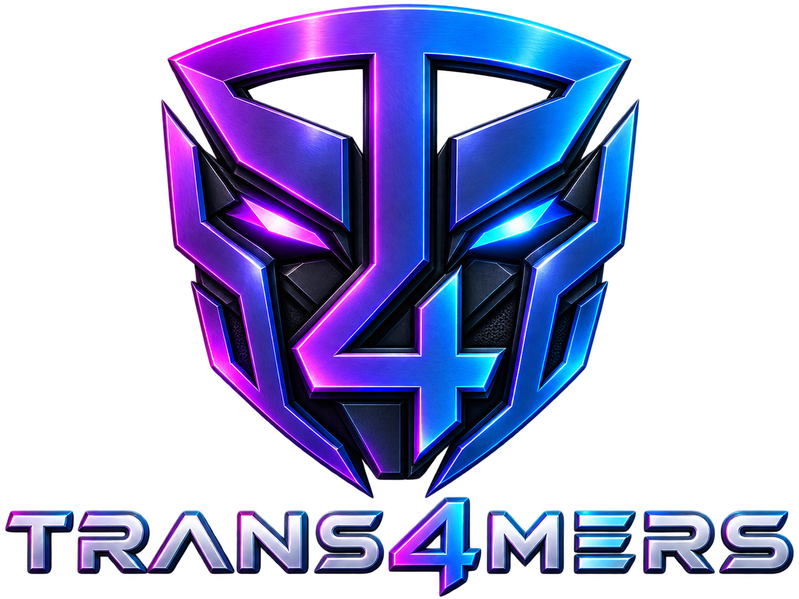
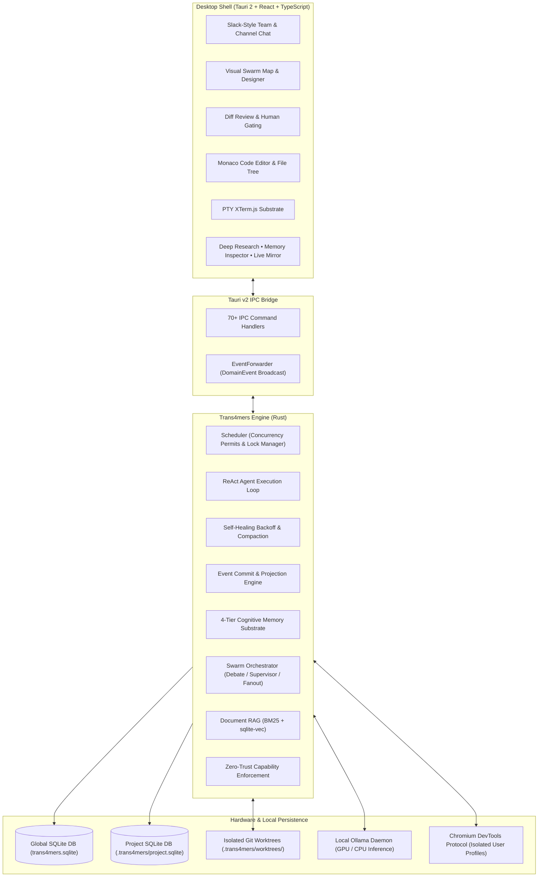
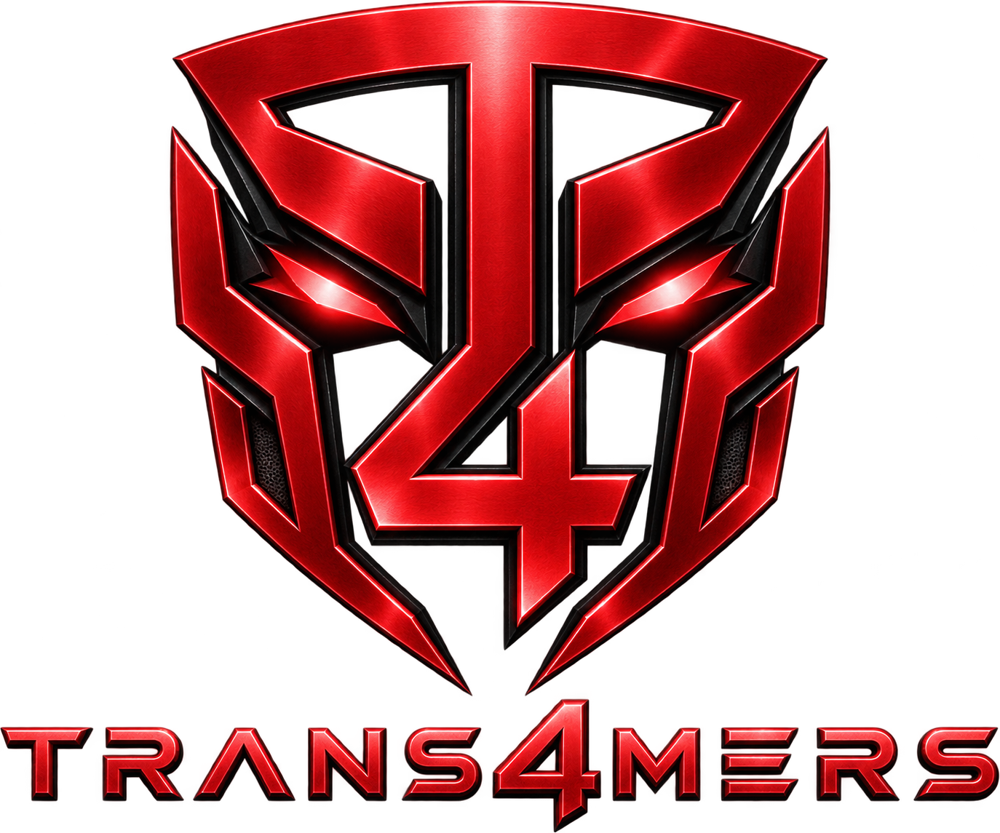
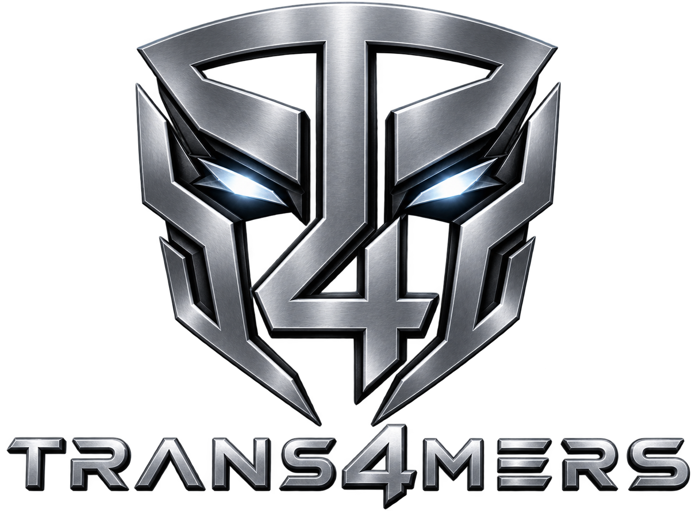
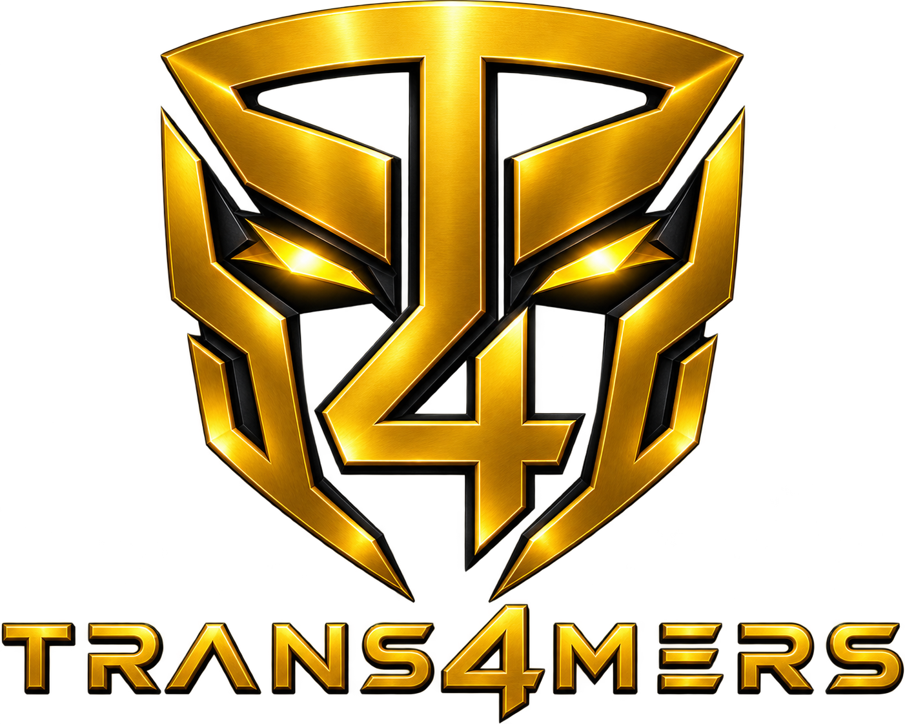

# Trans4mers: Sovereign Multi-Agent Desktop Operating System

<p align="center">
  
</p>

<p align="center">
  <a href="https://github.com/abhayzangir1/trans4mer/releases"></a>
  
  
  
  
  <a href="LICENSE"></a>
</p>

<p align="center">
  <strong>A zero-cloud, event-sourced, crash-resilient multi-agent operating system running 100% locally on your workstation.</strong>
</p>

<p align="center">
  <a href=#quick-start--one-click-install>Quick Start</a> •
  <a href=#core-capabilities>Capabilities</a> •
  <a href=#architecture>Architecture</a> •
  <a href=#subsystem-deep-dives>Subsystems</a> •
  <a href=#model-setup>Models</a> •
  <a href=#benchmarks--footprint>Benchmarks</a> •
  <a href=#codebase-structure>Structure</a> •
  <a href=#documentation>Docs</a>
</p>

---

## Overview

**Trans4mers** is a desktop operating system for autonomous AI agents built from the ground up with **zero mandatory cloud dependencies**, **provable crash resilience**, and **strict zero-trust human governance**. 

Unlike conventional agent wrappers that pipe your sensitive code to remote cloud APIs, Trans4mers runs completely offline on your workstation. It pairs **local LLM execution (Ollama)** with an embedded **SQLite + sqlite-vec** database and a native **Rust (Tauri 2) + React** desktop shell.

Every state mutation—from tool invocations and peer inbox messages to file modifications and memory decay—is committed to an **immutable append-only event store** before being projected into SQLite state tables. If the system is abruptly terminated mid-task (kill -9 or power outage), the engine automatically recovers on restart, replays pending events, and continues execution seamlessly without data loss.

---

## Quick Start & One-Click Install

### 1. Download Native Installer (Zero Friction)

Download the pre-compiled installer for your operating system directly from [**GitHub Releases**](https://github.com/abhayzangir1/trans4mer/releases/latest):

| Platform | Installer Package | Distribution Type |
| :--- | :--- | :--- |
| **Windows** | Trans4mers_0.1.0_x64-setup.exe | One-Click NSIS Installer (No admin UAC needed) |
| **macOS** | Trans4mers_0.1.0_universal.dmg | Native DMG (Apple Silicon & Intel Universal) |
| **Linux** | Trans4mers_0.1.0_amd64.AppImage / .deb | Portable AppImage & Debian Package |

---

### 2. One-Click Developer Launch (Windows)

If you have cloned the repository, launch Trans4mers immediately via the automated root runner:

```bat
.\run-app.bat
```

> **What `run-app.bat` does automatically:**
> 1. Detects if the local Ollama daemon is active; if not, starts it automatically in the background.
> 2. Verifies the Vite desktop frontend server on `http://localhost:1420`.
> 3. Launches the native `trans4mers-desktop.exe` binary.

---

### 3. Model Engine: Sovereign Local & Frontier BYOK <a id="model-setup"></a>

Trans4mers is strictly **model-agnostic**. It automatically discovers models in your environment and gives you complete autonomy over the reasoning engines powering your swarms:

- **Capable Local Workstation Execution (Ollama):** For 100% sovereign, private offline execution, Trans4mers integrates with any local Ollama endpoint. For heavy multi-agent workflows, refactoring, and multi-step tool calling, capable high-parameter models (such as `qwen2.5-coder:32b`, `deepseek-r1:32b+`, `llama3.3:70b`, or custom GGUFs) deliver rigorous reasoning without cloud data leakage.
- **Frontier Cloud BYOK (Bring Your Own Key):** When tasks demand frontier intelligence (such as Anthropic Claude 3.7 Sonnet / Opus, OpenAI o1 / o3-mini / GPT-4.5, or Google Gemini 2.0 Pro / Flash), you can enter your API keys directly into **Settings**. Keys are vaulted exclusively in your workstation's local OS Keyring (Windows Credential Manager / macOS Keychain / Linux Secret Service) and executed directly from your workstation with zero proxying or telemetry.
- **Per-Agent Model Specialization:** In the Swarm Designer, assign different models to different agent archetypes—for example, pairing local models for fast terminal and RAG sub-agents with frontier reasoning engines for the Lead Architect and Security Auditor.

---

## Core Capabilities

- **100% Local Sovereign Privacy:** No remote server telemetry, no tracking, no mandatory cloud subscriptions. Your code and prompts never leave your machine.
- **Event-Sourced CQRS Architecture:** All operations pass through commit_event, projecting state synchronously into SQLite relational tables and broadcasting via Tauri IPC to the UI.
- **Self-Healing ReAct Runtime:** Exponential backoff on transient errors, automatic context compaction when nearing token limits, and secondary model fallback routing.
- **Multi-Agent Swarm Designer:** Dynamic orchestration supporting **Supervisor-Worker**, **Adversarial Debate**, and **Concurrent Fan-Out** patterns.
- **Zero-Trust Diff Review & Human Approvals:** High-risk actions (file modifications, bash execution, external network calls) require explicit operator approval with canonical SHA-256 argument hashing and line-by-line hunk review.
- **4-Tier Cognitive Memory Pyramid:** Working, Episodic, Semantic, and Procedural memory tiers powered by SQLite FTS5 BM25 search and embedded sqlite-vec vector similarity.
- **Real-Time PTY Terminal:** Native duplex terminal sessions powered by portable-pty embedded directly into the workspace with xterm.js.
- **Chrome DevTools Protocol (CDP) Browser Spaces:** Isolated browser execution with per-space profiles, DOM snapshot history, and real-time live mirror rendering.
- **Document & Code RAG Substrate:** Automatic chunking and hybrid lexical/vector indexing across your entire project workspace.
- **Interactive Artifact Deliverables:** Markdown briefs, specifications, and code deliverables with threaded, line-anchored operator feedback.
- **Continuous Scheduled Automations & Nightly Dreaming:** Cron-based autonomous background agent loops and nightly memory consolidation worker.
- **Model Context Protocol (MCP) Client & Inspector:** Full MCP client support with secure credential vaulting, live protocol traffic logging, and integrated Node.js MCP Inspector.

---

## Architecture



---

## Subsystem Deep Dives

### 1. Sovereign ReAct Runtime & Self-Healing
Each agent executes a strict Thought $\to$ Action $\to$ Observation cycle. When an LLM inference fails due to context limits, rate throttling, or invalid JSON output, the built-in self-healing substrate kicks in:
- **Exponential Backoff:** Retries transient failures gracefully with jitter.
- **Context Compaction:** Automatically condenses working conversation history while preserving semantic rules and active goals.
- **Model Fallback:** Switches to secondary configured models when an endpoint is unreachable or budget-exhausted.

### 2. Visual Swarm Map & Collaboration Patterns
Deploy dynamic teams of agents with specialized archetypes (Architect, Senior Engineer, Security Reviewer, QA, Researcher):
- **Adversarial Debate:** Proponent and Critic agents iterate through structured arguments to eliminate blind spots and stress-test technical proposals.
- **Supervisor Orchestration:** A lead agent decomposes complex goals into sequential milestones and delegates them to worker agents with independent execution locks.
- **Parallel Fan-Out:** Distributes independent search, analysis, or refactoring tasks across multiple workers simultaneously and synthesizes the results.

### 3. 4-Tier Cognitive Memory Pyramid
Memory is structured into 4 distinct cognitive tiers:
1. **Working Memory:** In-flight execution state and immediate conversational context.
2. **Episodic Memory:** Checkpointed records of completed tasks, tool outputs, and user interactions.
3. **Semantic Memory:** Extracted domain facts, codebase idioms, and architectural invariants indexed with sqlite-vec embeddings.
4. **Procedural Memory:** Distilled behavioral rules, past fixes, and developer preferences learned over time.

### 4. Zero-Trust Diff Review & Security Approvals
Trans4mers enforces strict isolation on dangerous capabilities:
- Destructive file edits, terminal commands with risk level High, and external network requests generate an ActionDiff.
- Execution halts, yields its concurrency permit, and awaits explicit human review in the **Diff Review Panel**.
- Operators can inspect unified diffs line-by-line, accept or reject individual hunks, and approve execution with full audit provenance.

### 5. Browser Automation & Live Mirror
Agents can navigate documentation, test web applications, and extract live web data via native Chrome DevTools Protocol (CDP):
- Each browser space maintains an isolated profile directory in .trans4mers/browser_profiles/.
- The **Live Mirror Viewport** mirrors DOM snapshots, HTTP status codes, and captured page state directly in the desktop interface.
- Roll back to previous DOM checkpoints at any time with cryptographic tree hashing.

### 6. Deep Research Engine
A 5-stage cited research pipeline:
1. **Plan:** Deconstructs user inquiries into search facets.
2. **Search:** Queries local codebase RAG, semantic memories, and privacy-respecting web search.
3. **Extract:** Collects and indexes source statements with URL/file provenance.
4. **Synthesize:** Combines evidence into structured technical analysis.
5. **Cite:** Outputs footnoted Markdown reports and persists them as project artifacts.

---

## Visual Themes & Customization

Trans4mers features high-contrast cybernetic styling designed for extended programming sessions:

| Theme Variant | Preview | Accent Palette |
| :--- | :--- | :--- |
| **Neon Cyan (Default)** |  | `#06B6D4` Cyan / `#0F172A` Slate |
| **Crimson Red** |  | `#EF4444` Rose / `#18181B` Zinc |
| **Industrial Steel** |  | `#94A3B8` Slate / `#09090B` Pure Black |
| **Solar Yellow** |  | `#F59E0B` Amber / `#1C1917` Stone |

---

## Benchmarks & Resource Footprint

Tested on standard developer workstations (Apple M-series, Intel Core i7 / AMD Ryzen 7, 16GB RAM):

| Metric | Measured Value | Standard Cloud Competitors |
| :--- | :--- | :--- |
| **Desktop App Idle RAM** | **~78 MB** | 400 MB - 1.2 GB (Electron-based) |
| **Database Transaction Latency** | **< 1.2 ms** (SQLite WAL) | 80 - 350 ms (Remote Cloud DB) |
| **Event Replay / Recovery Time** | **< 45 ms** | Minutes / Not supported |
| **Network Egress (Local Mode)** | **0 KB/s (Strict Zero)** | Continuous code/prompt egress |
| **Concurrency Ceiling** | **8 Concurrent Agents** (Configurable) | Rate-limited by remote APIs |

---

## Codebase Structure

```text
trans4mers-local/
├── apps/
│   └── desktop/                 # Tauri v2 Desktop Application
│       ├── src/                 # React 18 + TypeScript + Tailwind UI
│       │   ├── components/      # Chat, Swarm Designer, Approvals, Terminal
│       │   ├── hooks/           # useAgents, useProject, useSettings
│       │   └── store/           # Zustand stores (project, conversation, swarm)
│       └── src-tauri/           # Rust Tauri application entrypoint & build hooks
├── assets/
│   └── branding/                # High-res logos and theme variants
├── core/
│   ├── trans4mers-app/          # 23 IPC command modules & event forwarder
│   ├── trans4mers-domain/       # Pure domain models, IDs, events, and config
│   ├── trans4mers-engine/       # Scheduler, ReAct runtime, RAG, Swarms, PTY
│   ├── trans4mers-providers/    # Ollama, OpenAI, Anthropic, Gemini, CDP, MCP
│   └── trans4mers-storage/      # SQLite engine, 27 repositories, FTS5 triggers
├── docs/                        # Architecture decisions, tutorials, specifications
├── plugins/                     # Example external Python/JSON-RPC plugins
├── scripts/                     # Cross-platform installer & packaging scripts
├── skills/                      # Declarative TOML skills (coding, research, debug)
├── Cargo.toml                   # Virtual workspace manifest
├── run-app.bat                  # One-click Windows launcher
└── README.md                    # Project documentation
```

---

## Building from Source

### Prerequisites
- **Rust:** 1.85+ (`rustup default stable`)
- **Node.js:** v18+ & `npm`
- **Ollama:** [https://ollama.com](https://ollama.com)

```bash
# 1. Clone repository
git clone https://github.com/abhayzangir1/trans4mer.git
cd trans4mer

# 2. Run automated test suite
cargo test --workspace --exclude trans4mers-desktop

# 3. Build frontend assets
cd apps/desktop
npm install
npm run build

# 4. Launch in development mode
npm run tauri dev
```

---

## Quality Verification & Test Suite

Run the full Rust workspace test suite:
```bash
cargo test --workspace --exclude trans4mers-desktop
```

Validate frontend TypeScript bundling:
```bash
cd apps/desktop && npm run build
```

Verify formatting and clippy lints across all core crates:
```bash
cargo check -p trans4mers-domain -p trans4mers-storage -p trans4mers-engine -p trans4mers-providers -p trans4mers-app
```

---

## Documentation

- [Architecture Decisions (docs/ARCHITECTURE_DECISIONS.md)](docs/ARCHITECTURE_DECISIONS.md) — Rationale for event sourcing, concurrency caps, and zero-trust gating.
- [Agent Tutorial (docs/AGENT_TUTORIAL.md)](docs/AGENT_TUTORIAL.md) — Guide to authoring and deploying custom agent archetypes.
- [Plugin Development (docs/PLUGIN_DEVELOPMENT.md)](docs/PLUGIN_DEVELOPMENT.md) — How to write external tools via JSON-RPC.
- [Contributing Guide (docs/CONTRIBUTING.md)](docs/CONTRIBUTING.md) — Code standards, PR guidelines, and verification rules.
- [Swarm Audit Report (docs/SWARM_AUDIT_REPORT.md)](docs/SWARM_AUDIT_REPORT.md) — Architectural integrity audit verification report.

---

## License

Trans4mers is released under the **[MIT License](LICENSE)**.  
Copyright &copy; 2026 Abhay Zangir. All rights reserved.
