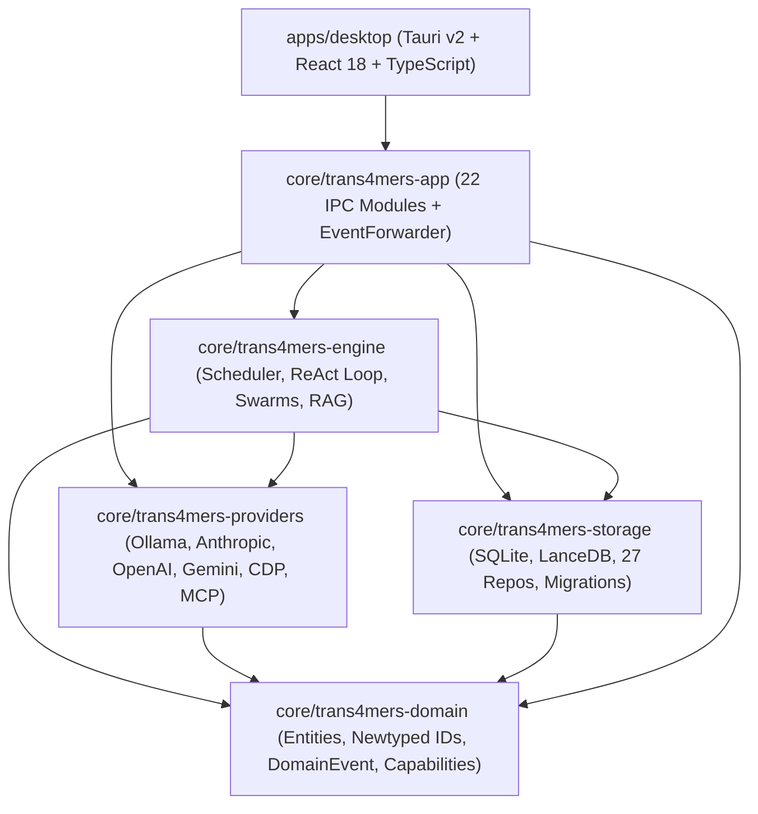

# Trans4mers: Sovereign Autonomous Multi-Agent Desktop Operating System
## Technical Requirements & Architecture Document (TRD)

---

## 1. System Architecture & Crate Topology

Trans4mers is structured as a unified Cargo workspace enforcing strict one-directional dependencies with zero cyclic links.



### 1.1 Crate Responsibilities
- **`trans4mers-domain`**: Pure data core. Newtyped strongly-typed identifiers ([`ProjectId`](../core/trans4mers-domain/src/ids.rs), [`AgentInstanceId`](../core/trans4mers-domain/src/ids.rs), [`ExecutionId`](../core/trans4mers-domain/src/ids.rs)), domain entities (`Message`, `Artifact`, `Diff`, `Memory`), model guidance catalog, and canonical `DomainEvent` definitions. Zero I/O dependencies.
- **`trans4mers-storage`**: Persistence management. Mutex-wrapped `DbHandle` single-writer connections, WAL journal configuration, migration scripts (`global/` and `project/`), repository query layers, and vector storage adapters (`SqliteVecStore`, `LanceDbStore`).
- **`trans4mers-providers`**: Stateless hardware and protocol drivers. Concrete implementations for Ollama, Anthropic, OpenAI, Google Gemini, Chromium DevTools Protocol (CDP), Model Context Protocol (MCP), and Langfuse.
- **`trans4mers-engine`**: Operational intelligence engine. Permit-based scheduler, ReAct state machine, git worktree orchestrator, hybrid RAG retrieval, context compactor, self-healing recovery, and event projectors.
- **`trans4mers-app`**: Tauri v2 application bridge. Implements 22 IPC command modules, OS Keyring secrets management, and the `EventForwarder` Tokio-to-IPC event bridge.
- **`apps/desktop`**: React 18 presentation layer. Constructed with Vite, Zustand, TailwindCSS, Monaco Code Editor, `@xterm/xterm`, and ReactFlow.

---

## 2. Data Architecture & CQRS Event Sourcing

### 2.1 Partitioned SQLite Storage Strategy
Persistent data is cleanly segregated by deletion lifecycle across two database tiers:

1. **Global Database (`~/.trans4mers/global.sqlite`)**:
   - Stores data outliving individual project lifecycles: project directory registry, global agent definitions, MCP server registry, credential keyrings, and system settings.
2. **Project Database (`<workspace>/.trans4mers/project.sqlite`)**:
   - Stores project-scoped state: append-only immutable `events` log, projected messages, conversations, executions, execution steps, cognitive memories, learned rules, approvals, artifacts, browser spaces, and vector tables.
   - Deleting a workspace removes all project data completely with zero orphaned records left on the machine.

### 2.2 Synchronous CQRS Transaction Commit
State mutations are executed within atomic write transactions (`with_write_tx`):
```rust
pub fn commit_event(
    tx: &Transaction,
    event: DomainEvent,
    actor_id: ActorId,
) -> Result<EventEnvelope, Trans4mersError> {
    // 1. Synchronously append to immutable event log
    let sequence_id = EventRepo::insert(tx, &envelope)?;
    envelope.sequence_id = sequence_id;

    // 2. Synchronously apply projections to relational tables
    EventProjector::project_event(tx, &envelope)?;

    Ok(envelope)
}
```
If power fails at any millisecond, SQLite WAL rollbacks guarantee that partial projections never exist without their corresponding logged event.

---

## 3. Concurrency Scheduler & Swarm Orchestration

### 3.1 Two-Phase Permit Acquisition (`scheduler.rs`)
To prevent global deadlock when multiple projects compete for execution slots:
```rust
// Phase 1: Atomically acquire project slot before touching the global semaphore
loop {
    let cap = scheduler.project_caps.get(&entry.project_id).map(|c| *c.value()).unwrap_or(4);
    let mut current_entry = scheduler.project_active.entry(entry.project_id).or_insert(0);
    if *current_entry < cap {
        *current_entry += 1;
        break;
    }
    drop(current_entry);
    scheduler.slot_available.notified().await;
}

// Phase 2: Acquire global semaphore permit
let permit = scheduler.permits.acquire_owned().await?;
```
- **Permit Yielding**: When an agent hits `PolicyOutcome::Ask` waiting for human approval, it drops its permit (`drop(current_permit.take())`), immediately freeing the execution slot for other agents.
- **Wake Latching**: If a new instruction arrives for an already running agent execution, the scheduler latches the wake signal (`wake_latch.insert(execution_id, true)`), re-enqueuing the agent upon step completion.

### 3.2 Git Worktree Dynamic Delegation (`delegate_task.rs` & `complete_task.rs`)
When delegating work to specialist sub-agents:
1. `GitWorkspace::create_agent_worktree` spawns an isolated git branch (`agent/{sub_agent_id}`) checked out into `.trans4mers/worktrees/{sub_agent_id}` via `git2::Repository::worktree`.
2. The child agent inherits bounded capabilities ($\mathrm{Caps}_{\mathrm{child}} = \mathrm{Caps}_{\mathrm{def}} \cap \mathrm{Caps}_{\mathrm{parent}}$) and executes its ReAct loop in complete workspace isolation.
3. Upon task completion, `complete_task` commits all worktree changes, merges the branch back into `main`, prunes the worktree directory from disk, and notifies the parent agent's inbox.

---

## 4. ReAct State Machine, Model Resolution & Recovery

### 4.1 ReAct Step Lifecycle (`agent_runtime.rs`)
The execution loop runs up to 25 steps per task:
1. **Inbox Claim**: Claims oldest `QUEUED` message from `inbox_messages`, marks `CLAIMED`, and emits `InboxMessageAcked`.
2. **Durable Checkpoint**: Saves `generation`, `ExecutionPhase`, `last_event_sequence`, and state context snapshot to `execution_checkpoints`.
3. **Context Compaction**: Uses BPE tokenization (`tiktoken_rs::cl100k_base`); if tokens exceed $75\%$ of context ceiling, oldest steps are pruned and replaced with an LLM-generated summary step.
4. **Hybrid RAG Recall**: Embeds query, fetching top 5 learned rules and top 10 relevant memories.
5. **Cost Guard**: Validates daily and monthly USD caps before dispatching inference.
6. **Streaming LLM Generation**: Emits `DomainEvent::TextDelta` chunks in real-time to the event bus for zero-latency UI streaming.
7. **Policy Interception**: Evaluates tool request against `PolicyEngine`. If `Ask`, drops permit and awaits human resolution.
8. **Tool Execution & Observation**: Dispatches tool via `ToolExecutor`, records observation, and advances step counter.

### 4.2 Dynamic Model Resolution Chain
Models resolve dynamically through a 6-tier fallback hierarchy:
```
1. Agent Instance Override      -> agent_instances.model_config_override
2. Conversation Override        -> conversations.settings.model_config_override
3. Agent Definition Default     -> agent_definitions.default_model_config
4. Project Default Setting      -> project_settings (default_provider, default_model)
5. App Config Providers         -> First enabled provider in config.toml
6. Zero-Egress Auto-Detection   -> Local Ollama manifest scanner on loopback
```

### 4.3 Self-Healing Taxonomy & Crash Recovery
- **F1 (State Failure)**: Database locks; retries 3 times with 500ms exponential backoff.
- **F2 (Logic Failure)**: Tool execution error; 0 retries for state mutations (prevents corruption), 2 retries for read-only operations, with escalation to parent agent inbox for child agents.
- **F3 (Hallucination)**: Schema/JSON parse failure; 3 retries with forced context compaction.
- **F4 (API Failure)**: LLM rate limit or 5xx; 5 retries with 2000ms exponential backoff.
- **Cold-Boot Crash Recovery (`recovery_manager.rs`)**: On startup, finds unfinalized `Running` executions, loads the latest checkpoint, replays domain events sequentially to restore context, resets orphaned `CLAIMED` inbox messages, and re-queues executions into the scheduler.

---

## 5. 4-Tier Memory & Hybrid RAG Engine

### 5.1 Cognitive Memory Pyramid & Lineage
- **Tiers**: `Working` (immediate scratchpad), `Episodic` (task traces), `Semantic` (verified facts), `Procedural` (operational constraints).
- **Promotion Rules**:
  - Working $\to$ Episodic: $\text{age} > 10\text{ minutes}$.
  - Episodic $\to$ Semantic: $\text{retrievals} \ge 3 \land \text{importance} \ge 0.6$.
  - Semantic $\to$ Procedural: $\text{retrievals} \ge 8 \land \text{importance} \ge 0.75$.
  - Episodic Stale Purge: $\text{retrievals} == 0 \land \text{importance} < 0.25 \land \text{age} > 14\text{ days}$.
- **Bi-Temporal Validity (`valid_at`, `invalid_at`)**: Memory mutations never overwrite rows in-place; the superseded memory is retired (`invalid_at = now`, `replaced_by = new_id`) and a new version is inserted with incremented `depth_level`.

### 5.2 Vector Serialization & Dual-Store Migration
- **Binary Layout (`vector_blob.rs`)**: Contiguous little-endian IEEE-754 32-bit floats ($4 \times D$ bytes). Stored directly in relational `embedding BLOB` columns.
- **Zero-Inference Migration (`vector_migration.rs`)**: Migrating between `sqlite-vec` (virtual `vec0` tables) and `LanceDB` (Apache Arrow files) deserializes stored BLOBs directly without calling external LLM embedding APIs.

### 5.3 Hybrid RRF & BM25 Ranking
$$\mathrm{RRF\_Score}(d) = \sum_{l \in \{\mathrm{BM25}, \mathrm{Vector}\}} \frac{1.0}{60.0 + \mathrm{rank}_l(d)}$$
- Dense vector distances are normalized via $\mathrm{Score} = \frac{1.0}{1.0 + \max(0.0, \text{distance})}$.
- Full-text lexical search utilizes SQLite FTS5 external content virtual tables (`project_memories_fts`, `doc_chunks_fts`, `learned_rules_fts`) with automated sync triggers.

### 5.4 Document Chunker Specifications
- Markdown: Breaks on `# ` to `#### ` headers ($\ge 80$ tokens, max $800$ tokens).
- Code: Breaks on top-level function/type declarations ($\ge 60$ tokens, max $750$ tokens).
- Ingestion skips binary files, directories matching ignore lists, and files $> 2\text{ MB}$, deduplicating on file SHA-256 hash.

---

## 6. Zero-Trust Security & Governance Trust Layer

### 6.1 Capability Lattice & Policy Engine
- Every tool declares an `EffectClass` (`ReadOnly`, `IdempotentMutation`, `NonIdempotentMutation`, `Unknown`), a `RiskLevel` (`Safe`, `Low`, `Medium`, `High`, `Critical`), and required `Capability` flags.
- Policy evaluation follows a **strict DENY-wins multi-layer hierarchy**:
  $$\text{Global Deny} \lor \text{Project Deny} \lor \text{Agent Deny} \implies \mathbf{DENY}$$
  If no layer denies, any layer specifying `Ask` forces human operator approval.

### 6.2 DiffReviewer & Anti-TOCTOU Verification
- **LCS Dynamic Programming**: Computes file unified hunks line by line.
- **Secret Scanning**: Diff payloads are matched against secret patterns (`password=`, `api_key=`, `sk_live_`, `BEGIN PRIVATE KEY`, etc.). Detecting a secret instantly bypasses all auto-approve rules and locks the action to `Pending`.
- **Anti-TOCTOU Canonical Hashing**: Tool arguments are normalized into key-sorted canonical JSON buffers and hashed via SHA-256:
  $$\mathrm{ArgumentsHash} = \mathrm{SHA256}(\mathrm{CanonicalKeySortedJSON}(\mathrm{arguments}))$$
  Upon resumption, the engine verifies that the live execution arguments match the approved hash before execution proceeds.

### 6.3 Advisory File Lease Locks (`lock_repo.rs`)
Atomic SQLite leases prevent multi-agent write collisions:
```sql
INSERT INTO locks (id, lock_key, holder, expires_at, created_at)
VALUES (?1, ?2, ?3, ?4, ?5)
ON CONFLICT(lock_key) DO UPDATE SET expires_at = excluded.expires_at
WHERE locks.holder = excluded.holder
```
Default TTL is 60 seconds. Conflicts return `false`, preventing concurrent write corruption.

---

## 7. External Protocols & Native Tooling

- **LLM Streaming Protocols**: NDJSON streaming for Ollama, SSE chunk streaming for OpenAI and Anthropic, and synthetic chunk adaptation for Google Gemini.
- **CDP Browser Spaces**: Sandboxed Chromium instances managed via `chromiumoxide` with isolated profiles at `.trans4mers/browser_profiles/<space_id>`, auth header injection, tree-hash snapshot rollbacks, and a 16,000-character markdown output cap.
- **Model Context Protocol (MCP)**: Client supporting Stdio process spawning and Streamable HTTP (SSE) transports, logging all traffic frames to `mcp_traffic_logs`, and launching the official MCP Inspector on port 5173.
- **Native PTY Terminal**: Duplex terminal sessions managed via `portable-pty` spawning `powershell.exe` (Windows) or `bash` (Unix) with byte streaming routed to `EventBus` (`DomainEvent::TerminalOutput`).
- **25 Native Built-in Tools**: Full native implementations for filesystem operations, git repository commands, terminal sessions, CDP browser automation, memory management, MCP dispatches, and task delegation.

---

## 8. Desktop Shell & Tauri IPC Bridge

### 8.1 22 IPC Command Modules
All IPC commands are exposed via `tauri::generate_handler!` in `main.rs`:
1. `project_commands.rs` (create, list, get, delete, vector migration)
2. `conversation_commands.rs` (create, list, get)
3. `message_commands.rs` (send with mention routing, get paginated)
4. `agent_commands.rs` (list, spawn, pause, resume, definitions CRUD, swarm debates, kill)
5. `execution_commands.rs` (list active, get details, cancel)
6. `approval_commands.rs` (pending approvals, resolve approval, diff reviews)
7. `memory_commands.rs` (get, search, promote tier, delete, pyramid stats)
8. `settings_commands.rs` (OS Keyring credentials, feature toggles, compaction config)
9. `provider_commands.rs` (test connection, list models, offline model guidance catalog)
10. `terminal_commands.rs` (create PTY session, write, resize, destroy)
11. `filesystem_commands.rs` (read, write, list directory, native folder picker)
12. `git_commands.rs` (status via git2)
13. `workflow_commands.rs` (DAG definitions, start run)
14. `artifact_commands.rs` (get artifacts, line comments, dispatch task)
15. `automation_commands.rs` (cron scheduled tasks, nightly dreaming trigger)
16. `gateway_commands.rs` (Telegram bot gateway status and config)
17. `system_commands.rs` (token usage, event replay, MCP lifecycle, system health probe)
18. `browser_commands.rs` (browser spaces, navigate, snapshots, rollbacks)
19. `mcp_commands.rs` (JSON-RPC protocol handler)
20. `document_commands.rs` (ingest documents, hybrid search)
21. `langfuse_commands.rs` (observability config, export traces)
22. `github_commands.rs` (credentials in Keyring, issue import, PR review approval and submit)

### 8.2 Event Forwarder & Sequence Cursor Reconciliation
- `EventForwarder` listens to Tokio `EventBus` broadcasts (`Arc<EventEnvelope>`) and emits payloads to Tauri's `"domain_event"` channel.
- Frontend components track `cursorRef.current` sequence IDs, load initial state from SQLite, and invoke `replay_events(project_id, cursor)` to guarantee zero dropped events during window focus changes.

### 8.3 Zero-Scope Security Boundary
- `tauri-plugin-fs` is **completely excluded** from `apps/desktop/src-tauri/Cargo.toml`.
- Tauri v2 permissions only grant `["core:default", "shell:allow-open"]`.
- All filesystem interactions are strictly routed through Rust's `FileSystemGuard::validate_path_in_workspace`, rejecting path traversal outside the authorized workspace root.
