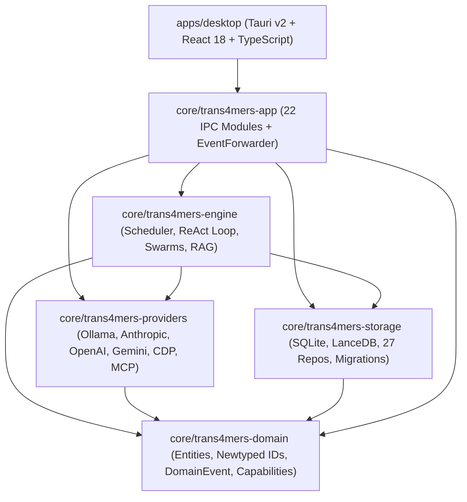

# Trans4mers Technical Requirements Document

## 1. System Architecture & Crate Topology

Trans4mers is structured as a Cargo workspace with strict one-directional dependencies.



### Crate Responsibilities
- `trans4mers-domain` defines the core data structures: newtyped IDs ([`ProjectId`](../core/trans4mers-domain/src/ids.rs), [`AgentInstanceId`](../core/trans4mers-domain/src/ids.rs), [`ExecutionId`](../core/trans4mers-domain/src/ids.rs)), domain entities (`Message`, `Artifact`, `Diff`, `Memory`), model guidance records, and the canonical `DomainEvent` enum. It contains zero I/O code.
- `trans4mers-storage` handles persistence through a mutex-wrapped `DbHandle` for single-writer SQLite connections, WAL journal configuration, SQL migrations (`global/` and `project/`), repository layers, and vector stores (`SqliteVecStore`, `LanceDbStore`).
- `trans4mers-providers` houses drivers for Ollama, Anthropic, OpenAI, Google Gemini, Chromium DevTools Protocol (CDP), Model Context Protocol (MCP), and Langfuse.
- `trans4mers-engine` implements runtime behavior: the concurrency scheduler, the ReAct loop, git worktree orchestration, hybrid RAG retrieval, context compaction, and self-healing logic.
- `trans4mers-app` exposes 22 IPC command modules to Tauri, handles credentials through the OS Keyring, and runs the `EventForwarder` bridge.
- `apps/desktop` is the React 18 frontend built with Vite, TailwindCSS, Monaco Editor, `@xterm/xterm`, and ReactFlow.

---

## 2. Data Architecture & Event Sourcing

### Partitioned SQLite Databases
Data is divided into two database files based on lifecycle:

1. Global database (`~/.trans4mers/global.sqlite`):
   Stores workstation-wide data that persists across projects: the project directory registry, agent templates, MCP server registrations, credential keyrings, and system settings.
2. Project database (`<workspace>/.trans4mers/project.sqlite`):
   Stores workspace-scoped records: the append-only `events` log, projected messages, conversations, executions, execution steps, memory records, learned rules, approvals, artifacts, browser spaces, and vector tables.
   Deleting a project directory removes all project data without leaving records behind.

### Transaction Commit Flow
Every state modification executes inside a single write transaction:
```rust
pub fn commit_event(
    tx: &Transaction,
    event: DomainEvent,
    actor_id: ActorId,
) -> Result<EventEnvelope, Trans4mersError> {
    // 1. Append to immutable event log
    let sequence_id = EventRepo::insert(tx, &envelope)?;
    envelope.sequence_id = sequence_id;

    // 2. Apply projections to relational tables
    EventProjector::project_event(tx, &envelope)?;

    Ok(envelope)
}
```
If the process dies during a write, SQLite WAL rollbacks prevent mismatched projections from persisting without their corresponding event log entry.

---

## 3. Concurrency Scheduler & Swarm Orchestration

### Two-Phase Permit Acquisition (`scheduler.rs`)
To avoid global deadlocks when multiple projects run concurrently:
```rust
// Phase 1: Reserve a project slot before requesting the global semaphore
loop {
    let cap = scheduler.project_caps.get(&entry.project_id).map(|c| *c.value()).unwrap_or(4);
    let mut current_entry = scheduler.project_active.entry(entry.project_id).or_insert(0);
    if *current_entry < cap {
        *current_entry += 1;
        break;
    }
    drop(current_entry);
    scheduler.slot_available.notified().await;
}

// Phase 2: Acquire global semaphore permit
let permit = scheduler.permits.acquire_owned().await?;
```
When an agent encounters an action requiring operator approval (`PolicyOutcome::Ask`), it drops its permit (`drop(current_permit.take())`). This frees the execution slot for other agents while waiting.
If a new user message arrives for an agent that is already active, the scheduler latches the wake signal (`wake_latch.insert(execution_id, true)`), re-enqueuing the agent when its current step finishes.

### Git Worktrees for Delegation (`delegate_task.rs` & `complete_task.rs`)
When delegating work to specialist sub-agents:
1. `GitWorkspace::create_agent_worktree` creates an isolated git branch (`agent/{sub_agent_id}`) checked out into `.trans4mers/worktrees/{sub_agent_id}` via `git2::Repository::worktree`.
2. The child agent inherits a subset of the parent's capabilities ($\mathrm{Caps}_{\mathrm{child}} = \mathrm{Caps}_{\mathrm{def}} \cap \mathrm{Caps}_{\mathrm{parent}}$) and runs its ReAct loop in that isolated directory.
3. When finished, `complete_task` commits worktree changes, merges the branch back into `main`, deletes the worktree folder, and posts a completion notice to the parent agent's inbox.

---

## 4. ReAct Runtime, Model Resolution & Recovery

### ReAct Loop Steps (`agent_runtime.rs`)
The engine executes up to 25 steps per run:
1. Inbox Claim: Pulls the oldest `QUEUED` message from `inbox_messages`, marks it `CLAIMED`, and emits `InboxMessageAcked`.
2. Checkpoint: Writes `generation`, `ExecutionPhase`, `last_event_sequence`, and state snapshot to `execution_checkpoints`.
3. Context Compaction: Tokenizes with `tiktoken_rs::cl100k_base`. If token count exceeds 75% of context limit, older steps are pruned and replaced with an LLM summary step.
4. Memory Retrieval: Queries memory tables for top 5 rules and top 10 relevant episodic records.
5. Budget Check: Confirms daily and monthly dollar caps before dispatching inference requests.
6. Streaming Generation: Broadcasts `DomainEvent::TextDelta` chunks to the event bus for immediate UI display.
7. Policy Check: Evaluates requested tools against `PolicyEngine`. If `Ask`, drops permit and waits for operator input.
8. Execution: Runs the tool via `ToolExecutor`, records output observations, and increments step count.

### Model Fallback Order
Model resolution falls back through six levels:
```
1. Agent Instance Override      -> agent_instances.model_config_override
2. Conversation Override        -> conversations.settings.model_config_override
3. Agent Definition Default     -> agent_definitions.default_model_config
4. Project Default Setting      -> project_settings (default_provider, default_model)
5. App Config Providers         -> First enabled provider in config.toml
6. Zero-Egress Auto-Detection   -> Local Ollama manifest scanner on loopback
```

### Self-Healing Categories & Recovery
- F1 (State Failure): Database locked errors; retries up to 3 times with 500ms backoff.
- F2 (Logic Failure): Tool run errors. Mutations do not retry to avoid duplicate side effects; read operations retry twice. Sub-agents escalate failures to their parent agent's inbox.
- F3 (Hallucination): Invalid JSON or schema parsing failures; retries up to 3 times with forced context compaction.
- F4 (API Failure): Provider timeouts or rate limits; retries up to 5 times with 2000ms exponential backoff.
- Crash recovery on cold boot: On startup, `RecoveryManager` scans for executions left in `Running` status, loads the latest checkpoint, replays domain events to rebuild context, resets orphaned `CLAIMED` inbox messages to `QUEUED`, and queues the execution again.

---

## 5. Memory & Hybrid RAG

### Memory Pyramid & Retention
- Four tiers classify memory: Working (immediate scratchpad), Episodic (task records), Semantic (distilled knowledge), Procedural (operational constraints).
- Promotion criteria:
  - Working to Episodic: age over 10 minutes.
  - Episodic to Semantic: at least 3 retrievals and importance at or above 0.6.
  - Semantic to Procedural: at least 8 retrievals and importance at or above 0.75.
  - Episodic cleanup: memories with 0 retrievals, importance below 0.25, and older than 14 days are deleted.
- Bi-temporal tracking: Updates do not overwrite rows. The old memory is marked inactive (`invalid_at = now`, `replaced_by = new_id`), and a new entry is added with an incremented depth level.

### Vector Storage & Serialization
- Embeddings serialize as little-endian IEEE-754 32-bit floats ($4 \times D$ bytes) stored directly in SQLite `embedding BLOB` columns.
- Migrations between `sqlite-vec` virtual tables and `LanceDB` Arrow files read the raw BLOBs directly without calling embedding APIs.

### Hybrid Search
$$\mathrm{RRF\_Score}(d) = \sum_{l \in \{\mathrm{BM25}, \mathrm{Vector}\}} \frac{1.0}{60.0 + \mathrm{rank}_l(d)}$$
- Dense vector distances normalize using $\mathrm{Score} = \frac{1.0}{1.0 + \max(0.0, \text{distance})}$.
- Text searches query SQLite FTS5 external content tables (`project_memories_fts`, `doc_chunks_fts`, `learned_rules_fts`) kept in sync with SQLite triggers.

### Document Chunker Settings
- Markdown splits on `# ` through `#### ` headings with a minimum of 80 tokens and a ceiling of 800 tokens.
- Code splits on function and type keywords with a minimum of 60 tokens and a ceiling of 750 tokens.
- The chunker currently uses non-overlapping partitions (0-token sliding overlap).
- Files over 2 MB, binary files, and ignored folders (`node_modules`, `target`, `.git`) are skipped. Files are deduplicated on SHA-256 hash.

---

## 6. Security and Policy Gating

### Capability Lattice and Evaluation
- Tools declare an `EffectClass` (`ReadOnly`, `IdempotentMutation`, `NonIdempotentMutation`, `Unknown`), a `RiskLevel` (`Safe`, `Low`, `Medium`, `High`, `Critical`), and required capabilities.
- Policy checks enforce a deny-wins rule across global, project, and agent scopes:
  $$\text{Global Deny} \lor \text{Project Deny} \lor \text{Agent Deny} \implies \mathbf{DENY}$$
  If no layer denies and any layer specifies `Ask`, the action pauses for operator sign-off.

### DiffReviewer and Argument Checks
- File diffs use longest common subsequence dynamic programming to generate unified hunks.
- Payloads are scanned for secret substrings (`password=`, `api_key=`, `sk_live_`, `BEGIN PRIVATE KEY`, etc.). Detecting any pattern overrides auto-approval and marks the proposal `Pending`.
- Anti-TOCTOU validation normalizes tool arguments into sorted canonical JSON and hashes them with SHA-256:
  $$\mathrm{ArgumentsHash} = \mathrm{SHA256}(\mathrm{CanonicalKeySortedJSON}(\mathrm{arguments}))$$
  Before executing an approved action, the engine verifies the live argument hash matches the approved hash.

### Advisory File Locks (`lock_repo.rs`)
Atomic SQLite leases prevent simultaneous edits to the same file:
```sql
INSERT INTO locks (id, lock_key, holder, expires_at, created_at)
VALUES (?1, ?2, ?3, ?4, ?5)
ON CONFLICT(lock_key) DO UPDATE SET expires_at = excluded.expires_at
WHERE locks.holder = excluded.holder
```
Leases default to 60 seconds. If another agent holds an unexpired lock, the acquisition returns false.

---

## 7. Protocols & Built-in Tools

- LLM streaming supports NDJSON lines for Ollama, SSE chunks for OpenAI and Anthropic, and synthetic stream adapters for Google Gemini.
- Browser spaces run isolated Chromium instances via `chromiumoxide` with user data stored at `.trans4mers/browser_profiles/<space_id>`. Includes cookie/header injection, directory snapshot rollbacks, and a 16,000-character markdown output cap.
- The Model Context Protocol client supports both Stdio child processes and remote Streamable HTTP (SSE) connections, logging all JSON-RPC frames to `mcp_traffic_logs` and running the official MCP Inspector on port 5173.
- Native PTY terminal sessions use `portable-pty` spawning `powershell.exe` on Windows or `bash` on Unix, with output pumped to `DomainEvent::TerminalOutput`.
- 25 native tools handle file I/O, git operations, terminal sessions, browser actions, memory indexing, MCP calls, and task delegation.

---

## 8. Desktop Shell & Tauri IPC Bridge

### IPC Command Modules
Commands are registered in `main.rs` through `tauri::generate_handler!`:
1. `project_commands.rs` (project CRUD and vector migrations)
2. `conversation_commands.rs` (channels and conversations)
3. `message_commands.rs` (messages and mention routing)
4. `agent_commands.rs` (instances, definitions, pause/resume, debates, cancel)
5. `execution_commands.rs` (active runs and ReAct history)
6. `approval_commands.rs` (pending approvals and diff reviews)
7. `memory_commands.rs` (memory inspection and pyramid stats)
8. `settings_commands.rs` (keyring credentials and configuration)
9. `provider_commands.rs` (connection probes, model lists, offline guidance)
10. `terminal_commands.rs` (PTY sessions, I/O, and resizing)
11. `filesystem_commands.rs` (safe workspace file I/O and folder picker)
12. `git_commands.rs` (repository status via git2)
13. `workflow_commands.rs` (graph definitions and run triggers)
14. `artifact_commands.rs` (artifacts and line comments)
15. `automation_commands.rs` (cron schedules and dreaming triggers)
16. `gateway_commands.rs` (Telegram bot status and config)
17. `system_commands.rs` (token usage, event replays, MCP registry, system probes)
18. `browser_commands.rs` (spaces, navigation, snapshot rollbacks)
19. `mcp_commands.rs` (JSON-RPC requests)
20. `document_commands.rs` (file ingestion and hybrid queries)
21. `langfuse_commands.rs` (observability export)
22. `github_commands.rs` (credential storage, issue import, PR review approvals)

### Event Forwarder & Sequence Tracking
`EventForwarder` subscribes to the Tokio `EventBus` broadcast channel and emits payloads over Tauri's `"domain_event"` IPC channel.
Frontend components track an in-memory sequence cursor (`cursorRef.current`). When mounting, components load saved state from SQLite and call `replay_events(project_id, cursor)` to catch any events missed during startup.

### Filesystem Isolation
`tauri-plugin-fs` is excluded from the Tauri application manifest. Frontend code has no direct filesystem permissions. All file calls pass through `FileSystemGuard::validate_path_in_workspace` in Rust, which canonicalizes paths and rejects attempts to navigate outside the project root.
