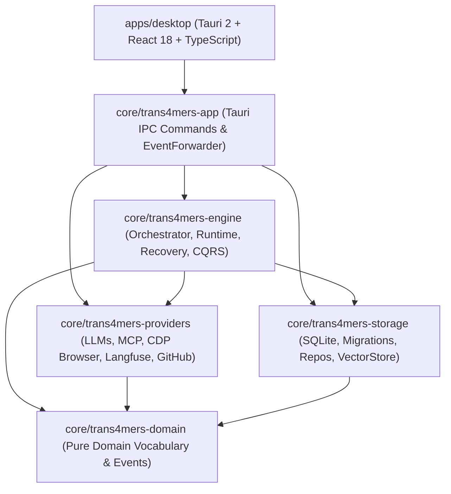

# Trans4mers: Sovereign Autonomous Agent Operating System
## Technical Requirements & Architecture Document (TRD)

---

## 1. System Architecture & Crate Topology

Trans4mers is constructed as a Cargo workspace with strict layer boundaries and one-directional dependencies. Higher-level crates depend on lower-level domain abstractions; no cyclic or inverted dependencies exist.



### 1.1 Crate Responsibilities
- **`trans4mers-domain`**: Pure vocabulary, newtyped IDs (`ProjectId`, `AgentId`, `ExecutionId`, `ConversationId`), domain models (`Message`, `Artifact`, `Diff`, `Memory`), model guidance catalog, and `DomainEvent` enum. Zero I/O dependencies.
- **`trans4mers-storage`**: Embedded SQLite management (`DbHandle`), database migrations (`global/` and `project/`), typed repositories, full-text search triggers, and `VectorStore` implementations (`SqliteVecStore`, `LanceDbStore`).
- **`trans4mers-providers`**: External I/O adapters for LLMs (Ollama, OpenAI, Anthropic, Gemini), Model Context Protocol (Stdio and Streamable HTTP), native CDP browser automation (`chromiumoxide`), Langfuse client, and GitHub API client.
- **`trans4mers-engine`**: Asynchronous execution loop, ReAct step parsing, permit-based concurrency scheduler, crash recovery manager, checkpoint manager, self-healing policies, and event projector.
- **`trans4mers-app`**: Tauri command handlers, OS Keyring secrets manager, Langfuse background observer, and event bridge forwarder.
- **`apps/desktop`**: React 18 frontend with Tailwind CSS, Zustand state stores, Monaco code editor, and XTerm.js terminal.

---

## 2. Data Architecture & Event Sourcing

### 2.1 Partitioned SQLite Strategy
The data layer is cleanly partitioned by deletion lifetime:
1. **Global Database (`$APPDATA/trans4mers/global.db`):**
   - Holds data that outlives individual projects: project registry, agent templates, global policies, cost ledgers, and MCP server registry.
   - Manages global settings and provider preferences.
2. **Project Database (`$PROJECT_ROOT/.trans4mers/project.db`):**
   - Holds project-scoped data: immutable append-only `events` log, projected messages, conversations, executions, execution steps, cognitive memories, learned rules, approval requests, artifacts, browser spaces, and vector tables.
   - Completely deleted when a project folder is removed, leaving zero orphaned state.

### 2.2 Concurrency & Transaction Model
- Every database is wrapped in a `DbHandle` with a mutex-guarded exclusive writer connection and a pool of concurrent reader connections.
- SQLite is opened in `WAL` mode (`PRAGMA journal_mode = WAL;`) with `PRAGMA synchronous = NORMAL;`, `PRAGMA foreign_keys = ON;`, and `PRAGMA busy_timeout = 5000;`.
- **Atomic CQRS Commit:** Every state mutation executes inside a single write transaction:
  ```rust
  // Synchronous append to event store + projection update
  conn.execute("INSERT INTO events (id, sequence_id, event_type, payload, ...) VALUES (...)")?;
  projector::apply_projection(tx, &event)?;
  // Commit transaction
  ```

---

## 3. Subsystem Technical Implementations (WS-1 to WS-9)

### 3.1 Sovereign CDP Browser Automation (WS-1)
- **Engine:** `core/trans4mers-providers/src/browser/cdp_manager.rs`.
- **Process Isolation:** Spawns Chromium with `--remote-debugging-port=0`, `--headless=new`, and `--user-data-dir=<temp_dir>`.
- **Ephemeral Port Extraction:** Extracts dynamic assigned port from Chrome's DevToolsActivePort file or stderr. Binds strictly to `127.0.0.1`.
- **Termination Guarantee:** Uses Windows Job Objects / Unix process group signals to guarantee all spawned Chrome child processes and renderer helpers are killed immediately upon space drop or application shutdown.
- **Security & Vault:** Injects cookies and headers from `browser_auth_entries` table. Validates URLs against space allowlists and blocklists before navigation.

### 3.2 Hybrid RAG Pipeline: BM25 + Vector + RRF (WS-2)
- **FTS5 Integration:** `M009__documents_fts5.sql` establishes `documents_fts` and `chunks_fts` virtual tables synchronized via SQLite triggers on `INSERT`, `UPDATE`, and `DELETE`.
- **Reciprocal Rank Fusion:** Queries FTS5 using BM25 scoring and `VectorStore` using cosine distance in parallel. Merges candidate lists with constant $k = 60$:
  ```rust
  let score = 1.0 / (60.0 + rank as f64);
  ```
- **Provenance:** Returns chunks with exact byte ranges, line numbers, and file paths.

### 3.3 VectorStore Trait Abstraction (WS-3)
- **Trait Definition:** `trans4mers-storage/src/vector_store.rs`:
  ```rust
  #[async_trait]
  pub trait VectorStore: Send + Sync {
      async fn search(&self, vector: &[f32], limit: usize) -> Result<Vec<VectorSearchResult>, Trans4mersError>;
      async fn upsert(&self, id: &str, vector: &[f32]) -> Result<(), Trans4mersError>;
      async fn delete(&self, id: &str) -> Result<(), Trans4mersError>;
      async fn count(&self) -> Result<usize, Trans4mersError>;
  }
  ```
- **`SqliteVecStore`:** Serializes `&[f32]` to little-endian IEEE-754 binary BLOBs and queries `sqlite-vec` virtual tables (`vec0`).
- **`LanceDbStore`:** Apache Arrow-backed columnar store for out-of-core scaling.

### 3.4 Cognitive Memory Architecture 2.0 (WS-4)
- **Structure:** 4 Tiers: Working, Episodic, Semantic, Procedural.
- **Deduplication Engine:** `memory_repo::insert_memory` computes SHA-256 content hashes. Existing matches update `retrieval_count`, `last_retrieved_at`, and boost `importance` without duplicate row insertion.
- **Background Housekeeping:** 60-second periodic sweep in `housekeeping.rs` deletes expired observations (`expires_at < NOW()`) and prunes low-confidence memories.
- **Approval Gating:** `DiffKind::MemoryMutation` emitted on write/delete; requires human confirmation in `DiffReviewPanel`.

### 3.5 Remote Streamable HTTP MCP Transport (WS-5)
- **Protocol:** Server-Sent Events (SSE) inbound stream combined with HTTP POST JSON-RPC outbound calls.
- **Client:** `trans4mers-providers/src/mcp/client.rs`.
- **Resilience:** Implements exponential backoff reconnect (1s, 2s, 4s; max 3 retries). Dynamically tracks `endpoint` redirection events with same-origin validation.
- **Keyring Credentials:** Bearer tokens stored in OS Keyring; zero plaintext token storage in SQLite.

### 3.6 MCP Inspector & Protocol Traffic Log (WS-6)
- **Database Schema:** `mcp_traffic_logs` table stores `id`, `server_name`, `direction` (Inbound/Outbound), `frame_type`, `payload`, `timestamp`.
- **Traffic Sink:** `McpTrafficSink` passively intercepts frames without blocking message pump.
- **Node Detection:** Pure Rust probing of `node` and `npx` via `which::which`.
- **Inspector Lifecycle:** `McpInspectorManager` manages child inspector processes with process group kill on cleanup.

### 3.7 Langfuse Opt-in Observability (WS-7)
- **Sovereign Default:** When unconfigured or disabled, zero sockets are opened, zero background tasks spawned.
- **Sanitization:** `redactor.rs` masks API keys (`sk-...`, `Bearer ...`, PEM blocks).
- **Prompt Scrubbing:** Prompts and completions replaced with `[REDACTED_BY_POLICY]` unless `capture_prompts` is explicitly toggled true.
- **Cost Invariant:** Local Ollama model calls explicitly recorded with $0.00 cost.

### 3.8 Sovereign GitHub Integration (WS-8)
- **Issue Ingestion:** Fetches issue titles, bodies, and comments via `GitHubClient`, persisting task records and Markdown brief artifacts with complete URL provenance.
- **PR Review Engine:** Parses unified git diffs, generating inline code comments and overall review statuses.
- **Zero-Leak Guarantee:** GitHub PAT stored exclusively in OS Keyring; canary token tests verify zero plaintext PAT strings written to SQLite.
- **Mandatory Approval Gate:** Emits `DiffKind::GitHubPrReview` action diffs; review submissions to the GitHub API are physically blocked until the operator approves the diff.

### 3.9 Streaming Generation & Model Guidance UX (WS-9)
- **Domain Streaming Abstraction:**
  ```rust
  pub enum LlmStreamChunk {
      TextDelta(String),
      ToolCallDelta { index: usize, id: Option<String>, name: Option<String>, arguments_delta: String },
      Usage(TokenMetrics),
      Finish { reason: Option<String> },
  }
  pub type LlmStream<'a> = Pin<Box<dyn Stream<Item = Result<LlmStreamChunk, Trans4mersError>> + Send + 'a>>;
  ```
- **Provider Implementations:**
  - `OllamaProvider`: ndjson line parsing over `bytes_stream()`.
  - `OpenAiCompatProvider`: SSE `data: ` chunk parsing.
  - `AnthropicProvider`: SSE event parser matching `content_block_delta` and `message_delta`.
- **Real-Time Event Broadcasting:** `agent_runtime.rs` broadcasts `DomainEvent::TextDelta` to `EventBus` and `ProjectEventHub`.
- **Atomic Cancellation:** `tokio::select!` checks `cancellation_token.cancelled()` on every chunk. Upon cancellation, generation terminates immediately and zero partial messages are written to the database.
- **Offline Model Guidance Catalog:** `model_guidance.rs` statically profiles 22 model families (Qwen, Llama, DeepSeek, Claude, GPT, Gemini, Nomic, BGE) with size classes, context limits, tool capabilities, and offline heuristic fallbacks. Operates with zero network calls.

---

## 4. Security Invariants & Process Hygiene

1. **Zero Network Egress by Default:** The default configuration opens zero outbound sockets except to `127.0.0.1:11434` (Ollama) and `127.0.0.1:<port>` (CDP browser).
2. **Keyring for Secrets:** API keys (OpenAI, Anthropic, Gemini, Langfuse, GitHub, MCP tokens) are stored in OS Keyring. SQLite stores only boolean flags indicating key presence.
3. **Fail-Closed Governance:** If a policy check, capability check, or approval verification errors or times out, the action is denied immediately.
4. **Process Tree Kill on Shutdown:** All background processes (browser instances, MCP Stdio servers, MCP inspector) are registered with lifecycle managers that issue process group termination signals during application shutdown.
