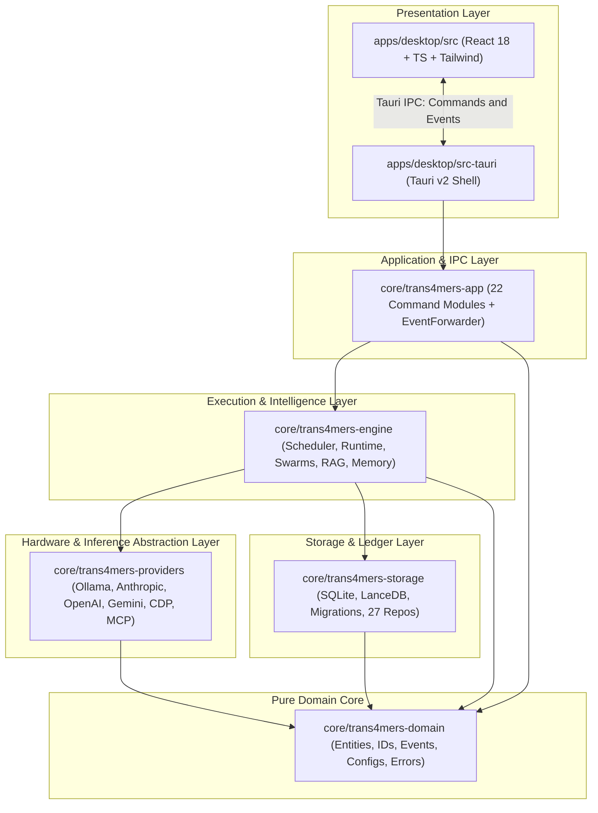
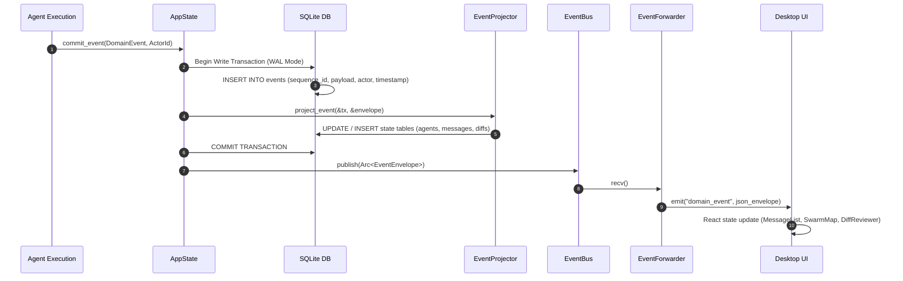
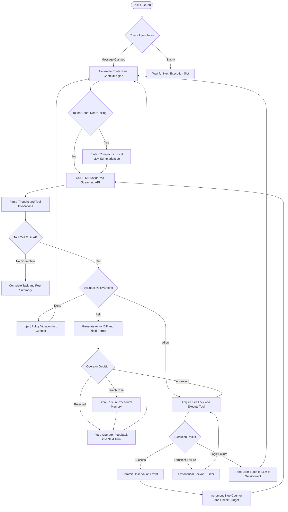
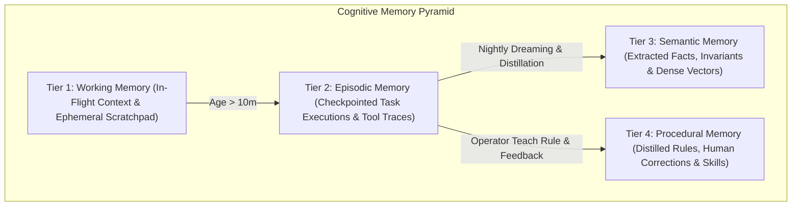
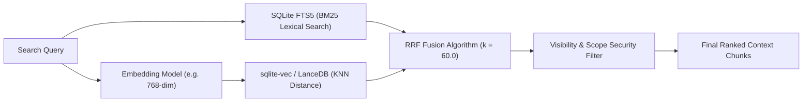
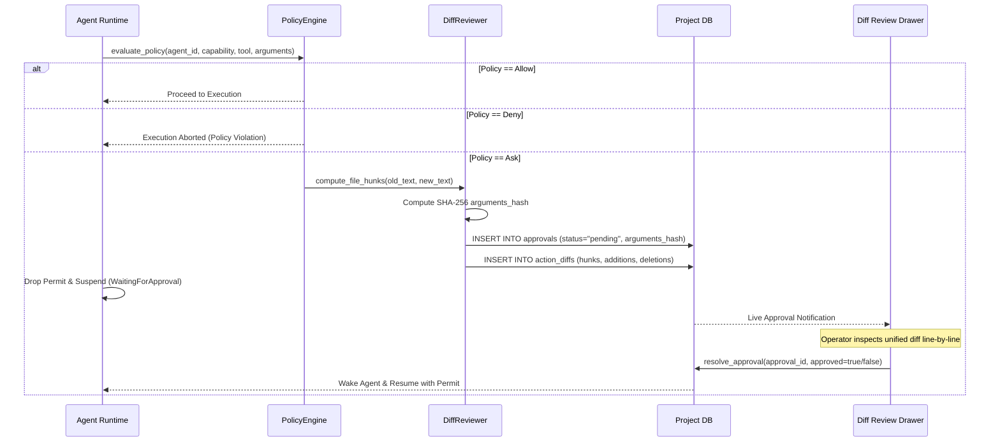
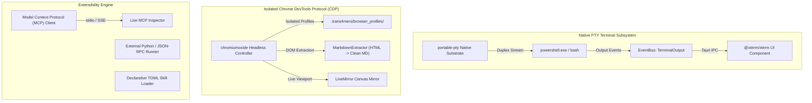
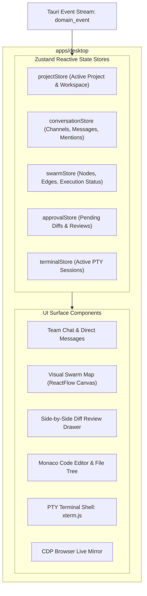

# Trans4mers Master System Architecture Specification

Welcome to the definitive architecture specification for **Trans4mers**, a sovereign multi-agent desktop operating system built in Rust and React/Tauri v2. This document provides the high-level system topology and architectural boundaries, and serves as the master index linking to five specialized, line-by-line reverse-engineered subsystem architecture specifications.

---

## Dedicated Subsystem Architecture Specifications

For unabridged, line-by-line technical deep-dives into specific subsystems, consult the dedicated architecture specifications:

| Subsystem | Specification Document | Primary Scope & Contents |
| :--- | :--- | :--- |
| **Memory & RAG** | [`MEMORY_AND_RAG_ARCHITECTURE.md`](architecture/MEMORY_AND_RAG_ARCHITECTURE.md) | 25-column SQLite schema, FTS5 sync triggers, IEEE-754 vector serialization, 4-tier promotion matrix, RRF ($k=60$) & Okapi BM25 math, DocumentChunker, and Nightly Dreaming. |
| **Agent & Swarms** | [`AGENT_AND_SWARM_ARCHITECTURE.md`](architecture/AGENT_AND_SWARM_ARCHITECTURE.md) | ReAct state machine loop, 6-tier dynamic model resolution, two-phase concurrency scheduler, dynamic git worktree delegation, and swarm debate topologies. |
| **Governance & Security** | [`GOVERNANCE_AND_SECURITY_ARCHITECTURE.md`](architecture/GOVERNANCE_AND_SECURITY_ARCHITECTURE.md) | 3D capability lattice (`EffectClass`, `RiskLevel`), 4-layer DENY-wins policy hierarchy, LCS diff engine, anti-TOCTOU canonical SHA-256 argument hashing, and lease locks. |
| **Protocols & Tooling** | [`PROTOCOLS_AND_TOOLING_ARCHITECTURE.md`](architecture/PROTOCOLS_AND_TOOLING_ARCHITECTURE.md) | Streaming inference drivers (Ollama, Anthropic, OpenAI, Gemini), CDP browser spaces and live mirror, MCP stdio/SSE client and inspector, PTY sessions, and 25 native tools. |
| **Frontend & IPC** | [`FRONTEND_AND_IPC_ARCHITECTURE.md`](architecture/FRONTEND_AND_IPC_ARCHITECTURE.md) | Complete catalog of all 22 Tauri IPC command modules, Tokio `EventForwarder`, Zustand reactive stores, sequence cursor reconciliation, and `FileSystemGuard` sandbox. |

---

## 1. Crate Topology & Workspace Dependency Architecture

Trans4mers is organized as a unified Cargo virtual workspace consisting of five core backend crates, one Tauri v2 native desktop application wrapper, and a TypeScript/React frontend shell.

### Crate Dependency Graph

### Architectural Boundaries & Invariants

1. **`trans4mers-domain`**: The bedrock crate. Contains pure data structures, strongly-typed identifiers ([`ProjectId`](../core/trans4mers-domain/src/ids.rs), [`ExecutionId`](../core/trans4mers-domain/src/ids.rs), [`AgentInstanceId`](../core/trans4mers-domain/src/ids.rs)), the canonical [`DomainEvent`](../core/trans4mers-domain/src/event.rs) enum, and the capability lattice.
2. **`trans4mers-storage`**: Persistence substrate. Contains raw SQL migration scripts ([`global`](../core/trans4mers-storage/src/migrations/global/) and [`project`](../core/trans4mers-storage/src/migrations/project/)), single-writer transaction wrappers, repository query implementations, and vector store adapters (`SqliteVecStore` and `LanceDbStore`).
3. **`trans4mers-providers`**: Stateless inference and external protocol drivers. Trait implementations for Ollama, Anthropic, OpenAI, Google Gemini, Chromium DevTools Protocol (CDP), and the Model Context Protocol (MCP).
4. **`trans4mers-engine`**: Operational execution engine. Manages the concurrency scheduler, the ReAct agent execution loop, the hybrid RAG retrieval pipeline, memory tier transitions, swarm debates, and the workspace worktree router.
5. **`trans4mers-app`**: Bridges Rust engine services to Tauri IPC handlers. Houses 22 distinct command modules and the [`EventForwarder`](../core/trans4mers-app/src/event_forwarder.rs) background emitter.
6. **`apps/desktop`**: Cross-platform desktop UI constructed with React 18, Zustand, TailwindCSS, `@xterm/xterm`, and `@monaco-editor/react`.

---

## 2. Event-Sourced CQRS & Durability Subsystem

Trans4mers rejects traditional CRUD architectures in favor of an **Event-Sourced Command Query Responsibility Segregation (CQRS)** pattern. The single source of truth for the entire operating system is the append-only `events` ledger.

### Write Path: Atomic Commit & Projection Loop

### Database Topology

| Database | Location | Scope | Contents |
| :--- | :--- | :--- | :--- |
| **Global DB** | `~/.trans4mers/global.sqlite` | Workstation-wide | Persists registered projects, global agent templates, MCP server registry, credential keyrings, and system settings. |
| **Project DB** | `<workspace>/.trans4mers/project.sqlite` | Per-Project Workspace | Persists immutable `events`, conversations, channels, execution traces, diff reviews, approvals, 4-tier memory vectors, document chunks, and FTS5 indices. |

---

## 3. Autonomous Agent Runtime & Concurrency Scheduler

Agent execution is driven by an asynchronous ReAct execution loop bounded by project-level and workstation-level concurrency caps.

*For comprehensive scheduler permit details, git worktree lifecycle, and swarm topologies, see [`AGENT_AND_SWARM_ARCHITECTURE.md`](architecture/AGENT_AND_SWARM_ARCHITECTURE.md).*

---

## 4. 4-Tier Cognitive Memory Pyramid & Hybrid RAG

Memory in Trans4mers is structured into four distinct cognitive tiers, mirroring human cognitive architecture:

### Hybrid RAG Retrieval (FTS5 + Vector Reciprocal Rank Fusion)

$$\mathrm{RRF}(d) = \frac{1.0}{60.0 + \mathrm{Rank}_{\mathrm{BM25}}(d)} + \frac{1.0}{60.0 + \mathrm{Rank}_{\mathrm{Vector}}(d)}$$

*For byte-exact IEEE-754 vector serialization, table columns, and promotion thresholds, see [`MEMORY_AND_RAG_ARCHITECTURE.md`](architecture/MEMORY_AND_RAG_ARCHITECTURE.md).*

---

## 5. Zero-Trust Policy Engine & Diff Review Subsystem

Agents are treated as untrusted actors. Dangerous operations cannot execute without passing through cryptographic verification and policy inspection.

### Anti-TOCTOU Canonical Argument Hashing
$$\mathrm{ArgumentsHash} = \mathrm{SHA256}(\mathrm{CanonicalKeySortedJSON}(\mathrm{arguments}))$$

*For full capability lattice definitions, secret scanner patterns, and advisory lease locks, see [`GOVERNANCE_AND_SECURITY_ARCHITECTURE.md`](architecture/GOVERNANCE_AND_SECURITY_ARCHITECTURE.md).*

---

## 6. Protocols, Inference & Native Tooling Subsystem

*For provider streaming details, browser snapshots, and the complete 25 native tools inventory, see [`PROTOCOLS_AND_TOOLING_ARCHITECTURE.md`](architecture/PROTOCOLS_AND_TOOLING_ARCHITECTURE.md).*

---

## 7. Tauri v2 Desktop Shell & Frontend State Projection

*For the catalog of all 22 Tauri IPC command modules, cursor reconciliation, and `FileSystemGuard` path validation, see [`FRONTEND_AND_IPC_ARCHITECTURE.md`](architecture/FRONTEND_AND_IPC_ARCHITECTURE.md).*

---

## Summary Matrix

| Subsystem | Primary Technology | Resilience Guarantee | Sovereign Boundary |
| :--- | :--- | :--- | :--- |
| **Storage** | SQLite + WAL + sqlite-vec | Synchronous write transactions; zero data loss on abrupt termination | Local `.sqlite` files; zero cloud databases |
| **Event Ledger** | Append-only `events` table | Strict event sourcing; projections derived deterministically | Local storage only; immutable audit trail |
| **Concurrency** | Tokio Semaphore + DashMap | Starvation-resistant age-boost queue; Conversation Mutex | Workstation CPU/GPU thread allocation |
| **Memory** | FTS5 BM25 + Vector RRF | Checkpointed turn history; automated nightly consolidation | Local embeddings (`nomic-embed-text`); zero egress |
| **Governance** | SHA-256 Hunk Diff Review | Deterministic AST secret scanning; operator approval gating | Cryptographic verification on every mutation |
| **Terminal** | `portable-pty` + `@xterm/xterm` | Dedicated child process isolation per session | Local workstation shells (`powershell.exe`/`bash`) |
| **Browser** | `chromiumoxide` CDP | Per-space profile directory isolation | Isolated local Chromium processes; no remote sync |
