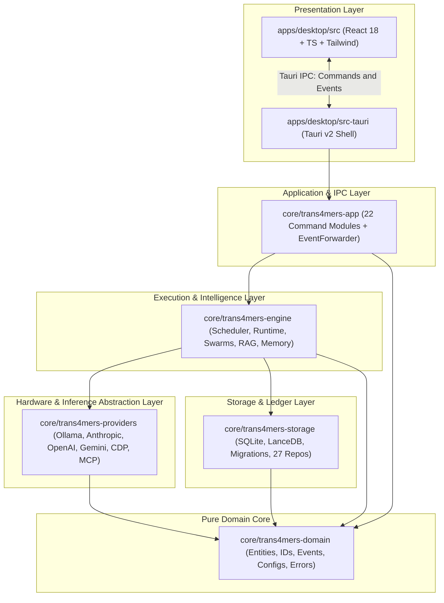
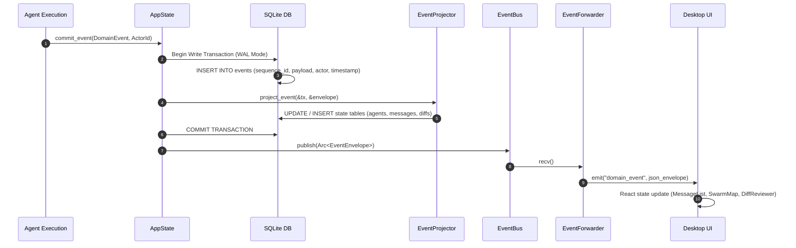
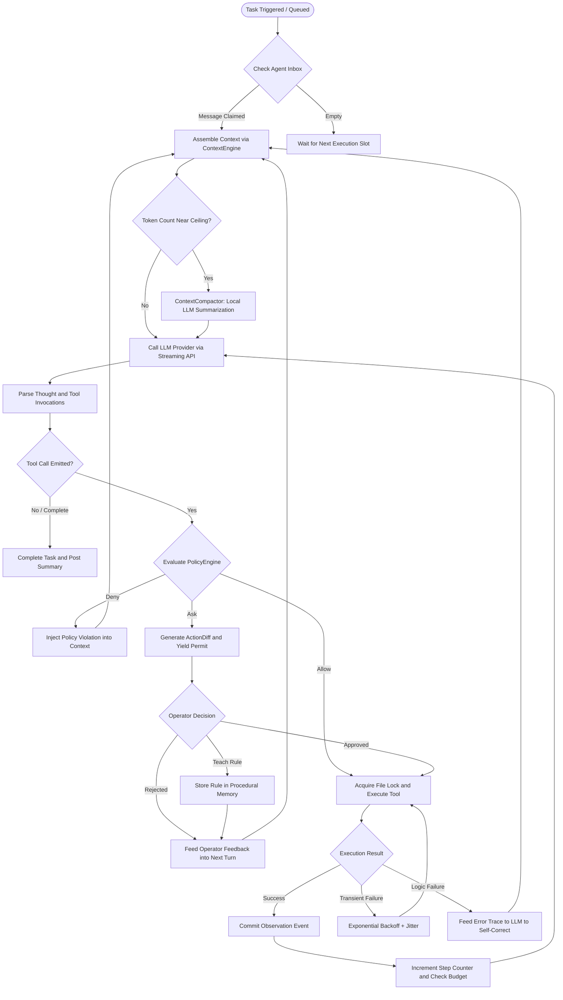
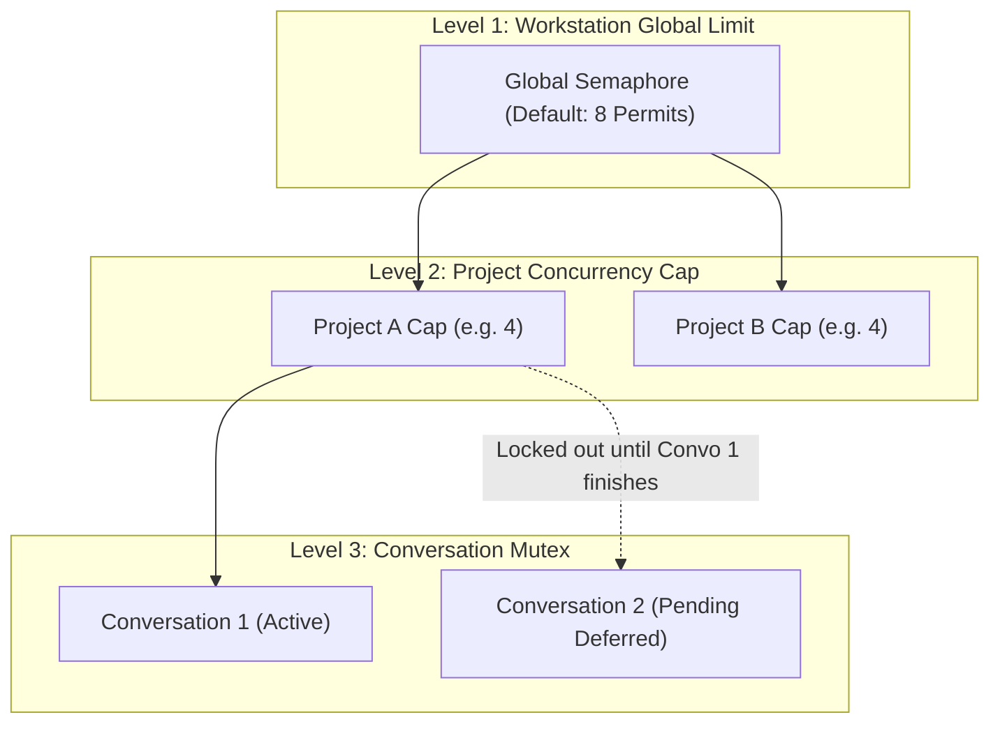
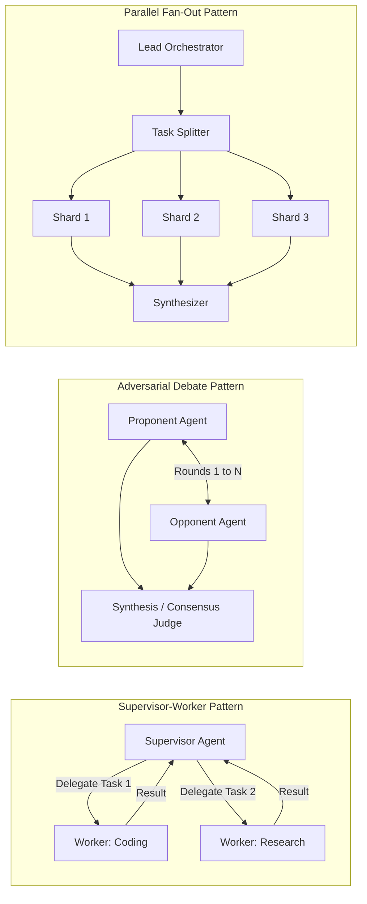
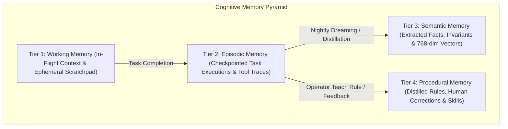
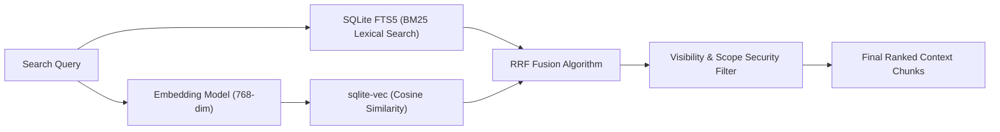
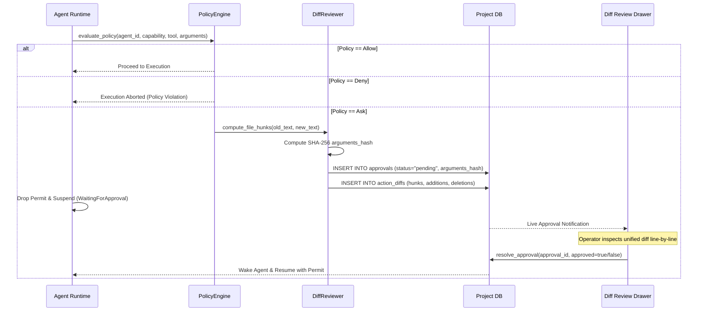
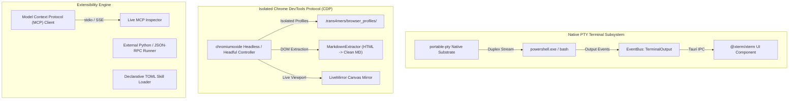
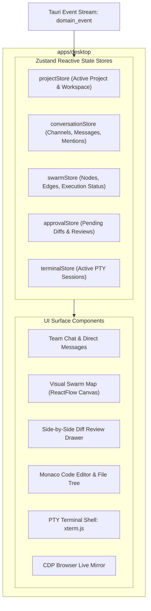

# Trans4mers System Architecture Reference

Welcome to the definitive architecture specification for **Trans4mers**, a sovereign multi-agent desktop operating system. This document is written for engineers, contributors, and systems architects who want to understand the raw, unadorned reality of how Trans4mers operates across every layer of its stack.

---

## Table of Contents

1. [Crate Topology & Workspace Dependency Architecture](#1-crate-topology--workspace-dependency-architecture)
2. [Event-Sourced CQRS & Durability Subsystem](#2-event-sourced-cqrs--durability-subsystem)
3. [Agent Runtime & Self-Healing Execution Loop](#3-agent-runtime--self-healing-execution-loop)
4. [Multi-Agent Swarm Orchestration & Concurrency Model](#4-multi-agent-swarm-orchestration--concurrency-model)
5. [4-Tier Cognitive Memory Pyramid & Hybrid RAG](#5-4-tier-cognitive-memory-pyramid--hybrid-rag)
6. [Zero-Trust Policy Engine & Diff Review Subsystem](#6-zero-trust-policy-engine--diff-review-subsystem)
7. [PTY Terminal, CDP Browser & Extensibility Subsystems](#7-pty-terminal-cdp-browser--extensibility-subsystems)
8. [Tauri v2 Desktop Shell & Frontend State Projection](#8-tauri-v2-desktop-shell--frontend-state-projection)

---

## 1. Crate Topology & Workspace Dependency Architecture

Trans4mers is organized as a unified Cargo virtual workspace consisting of five core backend crates, one Tauri v2 native desktop application wrapper, and a TypeScript/React frontend shell.

### Crate Dependency Graph



### Architectural Boundaries & Invariants

1. **`trans4mers-domain`**: The bedrock crate. It has zero internal workspace dependencies and contains only pure data structures, strongly-typed identifiers ([`ProjectId`](../core/trans4mers-domain/src/ids.rs), [`ExecutionId`](../core/trans4mers-domain/src/ids.rs), [`AgentInstanceId`](../core/trans4mers-domain/src/ids.rs)), the canonical [`DomainEvent`](../core/trans4mers-domain/src/event.rs) enum, and capability definitions.
2. **`trans4mers-storage`**: The sole manager of persistence. Contains raw SQL migration scripts ([`global`](../core/trans4mers-storage/src/migrations/global/) and [`project`](../core/trans4mers-storage/src/migrations/project/)), single-writer transaction wrappers, repository query implementations, and vector store adapters (`SqliteVecStore` and `LanceDbStore`).
3. **`trans4mers-providers`**: Stateless inference and external protocol drivers. It provides standard trait implementations for Ollama, Anthropic, OpenAI, Google Gemini, Chromium DevTools Protocol (CDP), and the Model Context Protocol (MCP). It does not hold database connections; token consumption metrics ride back on the response payloads.
4. **`trans4mers-engine`**: The operational brain. Manages the concurrency scheduler, the ReAct agent execution loop, the hybrid RAG retrieval pipeline, memory tier transitions, swarm debates, and the workspace worktree router.
5. **`trans4mers-app`**: Bridges Rust engine services to Tauri IPC handlers. Houses 22 distinct command modules and the [`EventForwarder`](../core/trans4mers-app/src/event_forwarder.rs) background emitter.
6. **`apps/desktop`**: Native cross-platform desktop UI constructed with React 18, Zustand, TailwindCSS, `@xterm/xterm`, and `@monaco-editor/react`.

---

## 2. Event-Sourced CQRS & Durability Subsystem

Trans4mers rejects traditional CRUD architectures in favor of an **Event-Sourced Command Query Responsibility Segregation (CQRS)** pattern. The single source of truth for the entire operating system is the append-only `events` ledger.

### Write Path: Atomic Commit & Projection Loop



### Database Topology

Trans4mers maintains two distinct SQLite database tiers per workstation:

| Database | Location | Scope | Lifecycle & Contents |
| :--- | :--- | :--- | :--- |
| **Global DB** | `~/.trans4mers/global.sqlite` | Workstation-wide | Persists registered projects, global agent templates, MCP server registry, credential keyrings, and system settings. |
| **Project DB** | `<workspace>/.trans4mers/project.sqlite` | Per-Project Workspace | Persists immutable `events`, conversations, channels, execution traces, diff reviews, approvals, 4-tier memory vectors, document chunks, and FTS5 indices. |

### The `commit_and_emit` Invariant

Every state mutation executes inside the single-writer transaction function:
```rust
// core/trans4mers-engine/src/cqrs.rs
pub fn commit_event(
    tx: &Transaction,
    event: DomainEvent,
    actor_id: ActorId,
) -> Result<EventEnvelope, Trans4mersError> {
    // 1. Serialize and Append to Event Store (Immutable Log)
    let sequence_id = EventRepo::insert(tx, &envelope)?;
    envelope.sequence_id = sequence_id;

    // 2. Apply Projections to Relational Models (Synchronous within transaction)
    EventProjector::project_event(tx, &envelope)?;

    Ok(envelope)
}
```

If power fails or the process is killed at any nanosecond, SQLite rollbacks guarantee that partial projections never exist without their underlying event.

### Cold-Boot Crash Recovery

Upon startup, the [`RecoveryManager`](../core/trans4mers-engine/src/recovery_manager.rs) inspects the database before launching any services:
1. Identifies any executions left in `Running` status without an exit event.
2. Replays the event log from the last saved `CheckpointSaved` boundary.
3. Restores working memory scratchpads and re-queues pending executions into the [`Scheduler`](../core/trans4mers-engine/src/scheduler.rs).
4. Prunes dangling git worktrees and releases stale file lease locks.

---

## 3. Agent Runtime & Self-Healing Execution Loop

Each autonomous agent operates as an asynchronous ReAct (Reasoning + Acting) state machine.

### The ReAct Cycle & Decision Flow



### Dynamic Model Resolution Chain

Trans4mers never forces hardcoded models. Models resolve dynamically at runtime through a strict 6-tier hierarchy:

```
[Agent Instance Override]
       │ (if None)
       ▼
[Conversation Settings Override]
       │ (if None)
       ▼
[Agent Definition Explicit Model]
       │ (if inherited / default)
       ▼
[Project Default Model (project_settings)]
       │ (if None)
       ▼
[Workstation App Default (config.toml)]
       │ (if unreachable)
       ▼
[Local Ollama Auto-Discovery Scan]
```

### Self-Healing Failure Classification

The runtime handles errors according to four distinct failure classes:

| Class | Type | Response Strategy |
| :--- | :--- | :--- |
| **F1** | Transient Transport Error (HTTP 429, 503, socket timeout) | Exponential backoff with random jitter (up to 3 retries) without burning step budget. |
| **F2** | Tool Execution Failure (Exit code $\ne 0$, file not found, bad args) | Result is formatted as a structured `ToolResult` observation; LLM receives error output to plan a corrective step. |
| **F3** | Malformed Output / Schema Mismatch | Prompt is augmented with expected JSON schema constraints and immediately re-prompted. |
| **F4** | Loop Stall / Repetitive Thoughts | Cycle detection detects identical consecutively repeated thoughts and escalates to the operator with a `WaitingForMessage` state. |

---

## 4. Multi-Agent Swarm Orchestration & Concurrency Model

Trans4mers supports dynamic, multi-agent teams executing under strict hardware and workspace concurrency guarantees.

### 3-Level Concurrency Hierarchy



### The Conversation Mutex Rationale

All agents operating within a project share the underlying filesystem workspace. Allowing multiple concurrent conversations to mutate the workspace simultaneously causes git index lock contention and conflicting edits. 

The [`Scheduler`](../core/trans4mers-engine/src/scheduler.rs) enforces a strict **Conversation Mutex**:
- Exactly **one conversation** per project can hold active execution permits.
- Other conversations in the same project are queued as `Pending`.
- To prevent starvation, pending entries accumulate an **age bonus** (+1 effective priority per 1,024 epochs) so old tasks cannot be indefinitely delayed by rapid incoming wakes.
- Different projects execute concurrently without restriction up to the workstation's global permit ceiling.

### Swarm Collaboration Topologies



---

## 5. 4-Tier Cognitive Memory Pyramid & Hybrid RAG

Memory in Trans4mers is structured into four distinct cognitive tiers, mirroring human cognitive architecture:



### Hybrid RAG Retrieval (FTS5 + Vector Reciprocal Rank Fusion)

When searching documents or memories, Trans4mers runs lexical and vector queries concurrently, merging the ranking via **Reciprocal Rank Fusion (RRF)**:

$$\text{RRF\_Score}(d) = \frac{1}{60 + \text{Rank}_{\text{BM25}}(d)} + \frac{1}{60 + \text{Rank}_{\text{Vector}}(d)}$$



---

## 6. Zero-Trust Policy Engine & Diff Review Subsystem

Agents are treated as untrusted actors. Dangerous operations cannot execute without passing through cryptographic verification and policy inspection.

### Capability Lattice & Action Diff Pipeline



### SHA-256 Canonical Argument Hashing

To prevent Time-of-Check to Time-of-Use (TOCTOU) attacks, approval records store a canonical hash:
$$\text{arguments\_hash} = \text{SHA-256}(\text{CanonicalKeySortedJSON}(\text{arguments}))$$

When execution resumes, the runtime verifies that the arguments executing are byte-for-byte identical to the arguments the human operator approved.

---

## 7. PTY Terminal, CDP Browser & Extensibility Subsystems

Trans4mers provides native operating system primitives without intermediate web containers.

### Subsystem Capabilities



---

## 8. Tauri v2 Desktop Shell & Frontend State Projection

The presentation layer is fully decoupled from engine execution.

### Frontend Architecture Breakdown



### Security Boundary: Zero-Scope Filesystem

In `tauri.conf.json`, the standard Tauri filesystem plugin scope is configured to **completely empty**. 

Frontend code cannot read or write arbitrary files on your workstation. All filesystem queries must pass through the `WorkspaceFileSystem` in Rust, which canonicalizes paths and strictly bounds operations to the project's authorized root directory.

---

## Summary Matrix

| Subsystem | Primary Technology | Resilience Guarantee | Sovereign Boundary |
| :--- | :--- | :--- | :--- |
| **Storage** | SQLite + WAL + sqlite-vec | Synchronous write transactions; zero data loss on abrupt termination | Local `.sqlite` files; zero cloud databases |
| **Event Ledger** | Append-only `events` table | Strict event sourcing; projections derived deterministically | Local storage only; immutable audit trail |
| **Concurrency** | Tokio Semaphore + DashMap | Starvation-resistant age-boost queue; Conversation Mutex | Workstation CPU/GPU thread allocation |
| **Memory** | FTS5 BM25 + Vector RRF | Checkpointed turn history; automated nightly consolidation | Local embeddings (`nomic-embed-text`); zero egress |
| **Governance** | SHA-256 Hunk Diff Review | Deterministic AST secret scanning; operator approval gating | Cryptographic verification on every mutation |
| **Terminal** | `portable-pty` + `@xterm/xterm` | Dedicated child process isolation per session | Local workstation shells (`powershell.exe`/`bash`) |
| **Browser** | `chromiumoxide` CDP | Per-space profile directory isolation | Isolated local Chromium processes; no remote sync |
