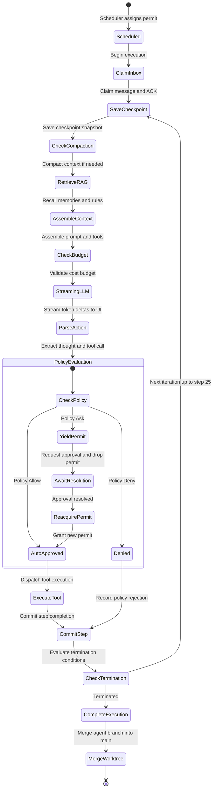
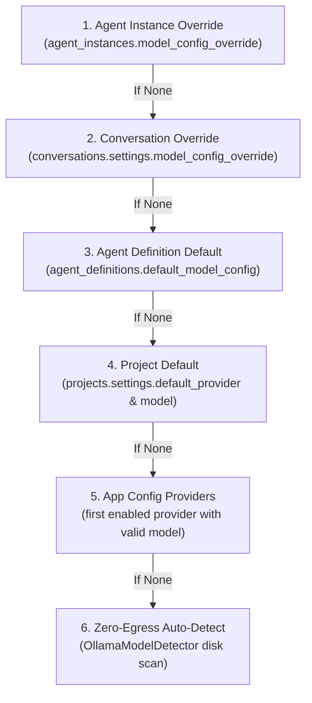
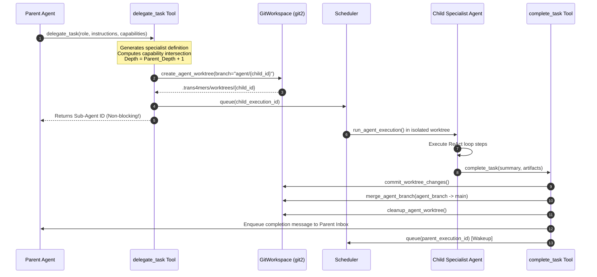
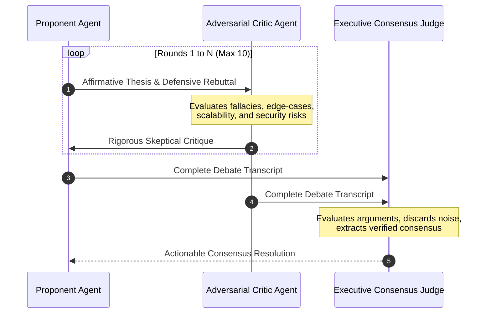

# Multi-Agent Runtime & Swarm Orchestration Architecture

This document details the Trans4mers multi-agent runtime, concurrency scheduler, dynamic delegation engine, and swarm orchestration topologies.

---

## 1. The Autonomous ReAct State Machine (`agent_runtime.rs`)

Agent execution in Trans4mers is driven by an asynchronous ReAct (Reasoning + Action) execution loop (`run_agent_execution`) in `core/trans4mers-engine/src/agent_runtime.rs`.



### Execution Loop Mechanics

1. **Permit Ownership & Initialization**:
   The runner receives `_permit: OwnedSemaphorePermit` to claim a scheduling slot, wrapped in `mut current_permit = Some(_permit)`. It emits and commits `DomainEvent::ExecutionStarted { execution_id, agent_instance_id }` via CQRS (`crate::cqrs::commit_event`), updating `agent_executions SET status = 'Running'` and broadcasting the change to both project and global event buses.

2. **Step Iteration (Capped at 25 Steps)**:
   - Cancellation: the loop checks `cancellation_token.is_cancelled()` at the start of each iteration.
   - Inbox claiming: claims the oldest queued message via `AgentInbox::claim_next(conn, agent_id)` inside a write transaction:
     ```sql
     SELECT * FROM inbox_messages
     WHERE recipient_agent_id = ?1 AND delivery_state = 'QUEUED'
     ORDER BY created_at ASC LIMIT 1
     ```
     It emits `DomainEvent::InboxMessageClaimed`, extracts the payload, formats the prompt as `"User Instruction from {sender}: {content}"`, and acknowledges receipt via `AgentInbox::ack_message` (`DomainEvent::InboxMessageAcked`).
   - Durable checkpointing: `CheckpointManager::save_checkpoint` writes the current generation, `ExecutionPhase::LlmGeneration`, `last_event_sequence`, and the full context snapshot `serde_json::to_value(&state)` to `execution_checkpoints`.
   - Context compaction: `ContextCompactor::compact_if_needed` checks if token usage exceeds the trigger threshold (e.g. 75% of context window). If so, it summarizes older steps to keep context within limits.
   - Memory recall: synthesizes a search query from the system prompt and the last three thoughts, generates embeddings with `provider.embed(&query_text, &model_config)`, and queries `MemoryEngine` for the top 5 learned constraint rules and top 10 relevant episodic memories.
   - Tool manifest assembly: formats registered tools from `ToolExecutor` into JSON Schema declarations, appending grammar constraints for providers that support structured outputs.
   - Context prompt construction: `ContextEngine::assemble_prompt_with_context` combines the system prompt, memories, rules, loaded skills, runtime status, and conversation history into `Vec<LlmMessage>`.
   - Cost Guard check: queries `cost_repo::get_daily_cost` and `get_monthly_cost` to enforce hard budget ceilings before dispatching the request.
   - Streaming LLM generation: `provider.generate_stream(&request)` streams token chunks to the UI via `DomainEvent::TextDelta` while accumulating `ToolCallDelta` fragments. On provider error, the self-healing retry loop engages. Token metrics are recorded in `token_usage` and `cost_entries`.
   - Policy evaluation and permit yielding: the tool call is evaluated by `PolicyEngine`. If the policy returns `PolicyOutcome::Ask`, the agent drops its permit via `drop(current_permit.take())` so other agents can make progress while awaiting human review. It emits `ApprovalRequested` and pauses. Once the operator resolves the approval (`ApprovalResolved`), it re-acquires a permit: `current_permit = Some(app_state.scheduler.acquire_permit().await?)`. If the policy is `PolicyOutcome::Allow`, it executes the tool via `executor.execute_tool(&tool_request)`.
   - Self-healing and error routing: tool failures are classified by `SelfHealing::handle_error`. If the failing agent is a delegated child with `fallback_to_delegation` enabled, it escalates the failure to the parent agent's inbox.
   - Step completion: emits `DomainEvent::ToolExecuted` and `DomainEvent::ExecutionStepCompleted`.
   - Termination: the loop terminates if the agent emits a thought without tool calls, if `complete_task` succeeds, if the 25-step cap is reached, or if consecutive identical errors or tool calls trigger the loop circuit breaker.
   - Worktree cleanup: if running in an isolated worktree branch (`agent/{agent_id}`), changes are committed and merged into main, followed by worktree directory cleanup.

---

## 2. Dynamic Model Resolution Hierarchy

Trans4mers resolves which LLM provider and model to invoke for any given agent execution through a 6-tier fallback chain:



---

## 3. Concurrency Management & Deadlock-Free Scheduler (`scheduler.rs`)

### Two-Phase Permit Acquisition
The `Scheduler` manages concurrent executions across projects using a combination of a global Tokio `Semaphore` and per-project active counters (`DashMap<ProjectId, usize>`):

```rust
// In scheduler.rs: try_schedule
// Phase 1: Atomically verify and acquire project slot BEFORE touching global semaphore
loop {
    let cap = scheduler.project_caps.get(&entry.project_id).map(|c| *c.value()).unwrap_or(4);
    let mut current_entry = scheduler.project_active.entry(entry.project_id).or_insert(0);
    if *current_entry < cap {
        *current_entry += 1;
        break;
    }
    drop(current_entry);
    let notified = scheduler.slot_available.notified();
    tokio::select! {
        _ = shutdown_rx.recv() => return,
        _ = notified => {}
    }
}

// Phase 2: Acquire global semaphore permit
let permit = permits.acquire_owned().await?;
```

> [!IMPORTANT]
> **Deadlock Prevention Rationale**: If an execution acquired the global permit first and then blocked waiting for a project slot, a saturated project would hoard all global permits, starving all other projects on the node and causing an unrecoverable system freeze. Phase 1 guarantees zero global permit hoarding.

### Wake Latching
If a new user message or task arrives for an agent execution that is already running:
- The scheduler does not spawn a duplicate concurrent task for the same execution.
- It inserts `wake_latch.insert(execution_id, true)`.
- When the currently executing loop finishes its active cycle, it drains the latch and immediately re-enqueues itself into the scheduler queue.

---

## 4. Dynamic Specialist Delegation (`delegate_task` & `complete_task`)

When a complex directive exceeds a single agent's specialization or context, it delegates work to an isolated sub-agent:



### Capability Bounding Rules
- If the parent agent possesses `Capability::AgentSpawn`, the child inherits the full default capability baseline of its definition.
- If the parent agent lacks `Capability::AgentSpawn`, the child receives only the strict intersection of the parent's current capabilities:
  $$\mathrm{Caps}_{\mathrm{child}} = \mathrm{Caps}_{\mathrm{def}} \cap \mathrm{Caps}_{\mathrm{parent}}$$
- The child's tree depth is strictly enforced:
  $$\mathrm{Depth}_{\mathrm{child}} = \mathrm{Depth}_{\mathrm{parent}} + 1$$

---

## 5. Swarm Orchestration Topologies (`swarm_orchestrator.rs`)

Trans4mers implements three distinct multi-agent coordination topologies:

### 1. Supervisor-Worker Pattern (`run_supervisor`)
1. The supervisor prompts the model to break down a macro objective into $N$ sequential milestones.
2. It iterates through the milestones, assigning each to an instantiated worker agent via `spawn_worker_execution`.
3. It polls SQLite for completion across worker execution IDs every 200ms with a 60-second timeout.
4. It compiles individual worker outputs into a final consolidated report.

### 2. Adversarial Debate Pattern (`run_debate`)
Used for critical architectural reviews, code audits, and strategic validation:



### 3. Parallel Fan-Out Pattern (`run_fanout`)
Used for batch file transformations, parallel testing, and distributed indexing:
- Distributes a homogeneous collection of subtasks round-robin across a pool of pre-allocated worker agents.
- Executes subtasks concurrently within the limits of project and global concurrency semaphores.
- Aggregates individual worker task results into a consolidated fan-out execution report.

---

## 6. Context Compaction & Sliding Window Math (`context_compactor.rs`)

To ensure agents never fail due to context window saturation, `ContextCompactor` monitors token consumption using BPE tokenization (`tiktoken_rs::cl100k_base`):

$$\mathrm{SafeThreshold} = \mathrm{MaxTokens} \times \mathrm{TriggerThresholdPct} \quad (\text{Default: } 8192 \times 0.75 = 6144 \text{ tokens})$$

### Compaction Algorithm
When `total_tokens > SafeThreshold`:
1. Scans steps from index 0 forward to compute `drop_count`.
2. Halts pruning when remaining unpruned steps satisfy:
   $$\mathrm{RemainingSteps} \le \mathrm{PreserveRecentMessages} \quad \lor \quad \mathrm{CurrentTokens} \le \frac{\mathrm{SafeThreshold}}{2}$$
3. Drains steps `0..drop_count`.
4. If `use_llm_summary` is enabled, prompts an internal summarization LLM:
   > *"You are an internal summarization agent. Summarize the following execution steps into a single dense paragraph detailing the actions taken and their outcomes."*
5. Prepends a synthetic summary step at `state.steps[0]`:
   ```json
   {
     "thought": "CONTEXT COMPACTION EVENT (summarized N historical steps): {summary}",
     "action": null,
     "result": null
   }
   ```

---

## 7. Self-Healing Taxonomy & Crash Recovery Replay

### Self-Healing Error Taxonomy (`self_healing.rs`)

| Class | Type | Causes | Recovery Strategy |
| :--- | :--- | :--- | :--- |
| **F1** | `State` | Database locked, schema mismatch | Exponential backoff (500ms), 3 retries, permit refresh |
| **F2** | `Logic` | Tool execution error | If mutation: 0 retries (prevents corruption). If read-only: 2 retries. If child agent: escalates to parent inbox. |
| **F3** | `Hallucination` | Malformed JSON, schema violation | 3 retries with forced `requires_context_compaction = true` |
| **F4** | `Api` | LLM timeout, rate limit, provider 5xx | 5 retries with 2000ms exponential backoff |

### Crash Recovery Replay (`recovery_manager.rs`)
Upon desktop restart after an unexpected process termination:
1. **Crash Detection**: Scans project databases for executions with status `Running` or `Checkpointing`.
2. **Snapshot Hydration**: Loads the most recent checkpoint from `execution_checkpoints` (`last_event_sequence` and `context_snapshot`).
3. **Event Log Replay**: Queries `domain_events` where `sequence_id > last_event_sequence ORDER BY sequence_id ASC`. Sequentially reapplies `ExecutionStepCompleted`, `ToolExecuted`, and `MessageSent` events to reconstitute live memory.
4. **Inbox State Reset**: Reverts orphaned `CLAIMED` inbox messages back to `QUEUED`:
   ```sql
   UPDATE inbox_messages
   SET delivery_state = 'QUEUED', claimed_at = NULL
   WHERE delivery_state = 'CLAIMED'
   ```
5. **Scheduler Re-enqueue**: Re-submits reconstituted execution IDs into the scheduling queue for seamless execution resumption.
