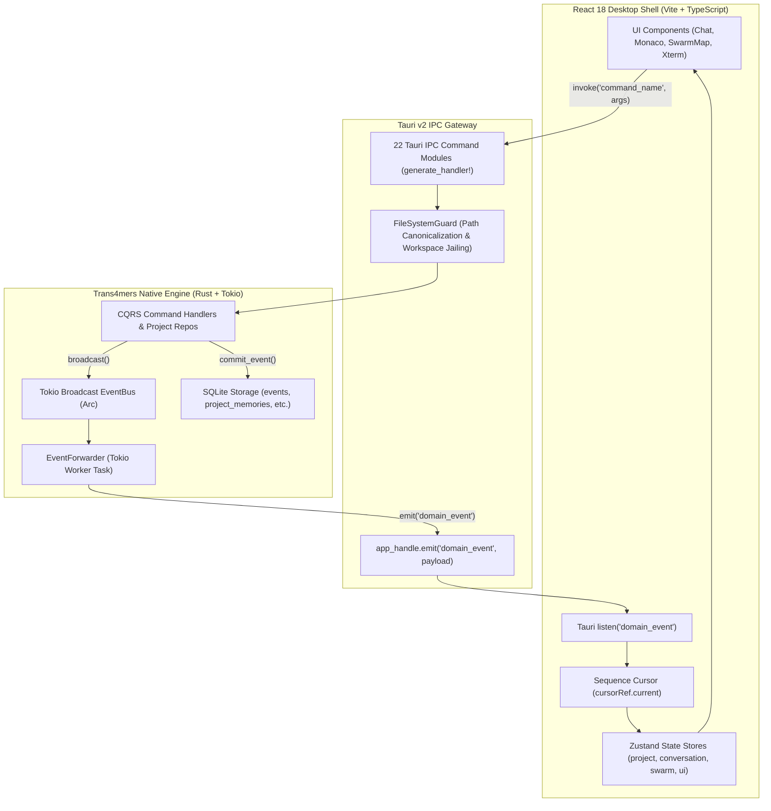

# Desktop Shell, State Projection & Tauri IPC Bridge Architecture

This document details the Trans4mers desktop shell: the 22 Tauri IPC command modules, the `EventForwarder` Tokio-to-WebView bridge, reactive Zustand state management, and the zero-scope security boundary.

---

## 1. Architectural Overview & IPC Topology

Trans4mers Desktop links a native Rust core (Tauri v2 and Tokio) with a TypeScript frontend (React 18, Vite, Zustand, Monaco Editor, and xterm.js) using an event-sourced CQRS architecture:



---

## 2. Catalog of Tauri IPC Command Modules

All commands are registered in `apps/desktop/src-tauri/src/main.rs` via `tauri::generate_handler!`:

### 1. `project_commands.rs`
- **`create_project(name, workspace_path, description)`**: Creates workspace directory, initializes git workspace via `git2`, registers project in `global.db`, provisions `.trans4mers/project.sqlite`, seeds default `#general` conversation, and instantiates the initial Boss Orchestrator agent.
- **`list_projects()`**: Reads all projects from `global.db`.
- **`get_project(project_id)`**: Fetches project metadata by UUID.
- **`delete_project(project_id)`**: Deletes project record and purges active in-memory database handles.
- **`vector_migrate(project_id, target_backend)`**: Migrates embeddings between `sqlite-vec` and `LanceDB`.
- **`get_vector_backend(project_id)`**: Reads the active vector backend setting.

### 2. `conversation_commands.rs`
- **`create_conversation(project_id, title)`**: Persists new conversation channel in project SQLite.
- **`list_conversations(project_id)`**: Lists all conversation channels for the active project.
- **`get_conversation(project_id, conversation_id)`**: Fetches details for a specific conversation.

### 3. `message_commands.rs`
- **`send_message(project_id, conversation_id, channel_id, content, mentions)`**:
  1. Routes `@mentions` to target agent instances (spawning dynamically if needed).
  2. Commits `MessageSent` event via CQRS transaction.
  3. Enqueues `InboxMessageQueued` into recipient agent inboxes.
  4. Wakes up the `Scheduler` via `scheduler.queue(exec_id, proj_id)`.
- **`get_messages(project_id, conversation_id, channel_id, limit, offset)`**: Reads paginated messages from SQLite.

### 4. `agent_commands.rs`
- **`list_agents(project_id)`**: Queries project `agent_instances` enriched with definitions from `global.db`.
- **`create_agent(project_id, definition_id, prompt)`**: Emits `AgentSpawned`, sets initial prompt, queues execution.
- **`pause_agent(project_id, agent_instance_id)`**: Commits `AgentStatusChanged` (`Paused`).
- **`resume_agent(project_id, agent_instance_id)`**: Commits `AgentStatusChanged` (`Active`).
- **`list_agent_definitions()`**, **`create_agent_definition(...)`**, **`get_agent_definition(id)`**, **`update_agent_definition(...)`**: Full CRUD for agent archetypes in `global.db`.
- **`start_swarm_debate(...)`**: Dispatches multi-agent adversarial debate in `SwarmOrchestrator`.
- **`start_supervisor_task(...)`**: Dispatches hierarchical goal decomposition and worker execution.
- **`start_swarm_fanout(...)`**: Dispatches parallel subtasks across worker agents.
- **`start_deep_research(...)`**: Dispatches autonomous iterative web research.
- **`kill_agent_execution(project_id, execution_id)`**: Triggers cancellation token, halting execution immediately.

### 5. `execution_commands.rs`
- **`list_active_executions(project_id)`**: Queries executions in `Running` or `Queued` states.
- **`get_agent_execution_details(project_id, agent_id)`**: Reconstitutes ReAct step history from checkpoints.
- **`cancel_execution(execution_id)`**: Sends cancellation signal to `Scheduler`.

### 6. `approval_commands.rs`
- **`get_pending_approvals(project_id)`**: Lists all pending operator approval requests.
- **`resolve_approval(project_id, approval_id, approved, feedback)`**: Commits `ApprovalResolved` to event bus.
- **`get_action_diff_by_approval(project_id, approval_id)`**: Fetches associated unified diff.
- **`get_pending_action_diffs(project_id)`**: Queries all pending diff reviews.
- **`resolve_action_diff(project_id, diff_id, decision, hunks)`**: Commits per-hunk approval decision.

### 7. `memory_commands.rs`
- **`get_memories(project_id, scope, tier, agent_id, limit)`**: Queries filtered memories.
- **`search_memories(project_id, agent_id, query, limit)`**: Executes hybrid vector + BM25 search.
- **`update_memory_tier(project_id, memory_id, new_tier)`**: Promotes or demotes cognitive memory tier.
- **`delete_memory(project_id, memory_id)`**: Deletes memory record.
- **`get_memory_pyramid_stats(project_id)`**: Computes aggregate memory counts and importance per tier.

### 8. `settings_commands.rs`
- **`get_settings()`**: Queries OS Keyring for API key presence and loads configuration profiles.
- **`update_settings(provider, api_key)`**: Securely saves API keys into OS Keyring.
- **`update_feature_toggles(features)`**: Updates runtime feature flags.
- **`update_provider_endpoint(provider, endpoint)`**: Configures custom inference endpoints (e.g. local Ollama).
- **`update_compaction_config(config)`**, **`update_diff_review_config(config)`**, **`update_performance_profile(profile)`**, **`set_default_provider(provider)`**: Hot-reloads engine configurations.

### 9. `provider_commands.rs`
- **`test_provider_connection(name, endpoint, model, api_key)`**: Validates provider connectivity.
- **`list_available_models(name, api_key, endpoint)`**: Queries live available models from provider.
- **`get_model_guidance(model)`**: Fetches offline guidance catalog metadata with **zero network egress**.
- **`list_model_guidance_catalog()`**: Returns the full offline model guidance directory.

### 10. `terminal_commands.rs`
- **`create_terminal_session(project_id, cols, rows)`**: Spawns OS PTY process attached to workspace.
- **`terminal_write(session_id, data)`**: Writes raw bytes into PTY stdin pipe.
- **`terminal_resize(session_id, cols, rows)`**: Updates PTY buffer dimensions.
- **`destroy_terminal_session(session_id)`**: Terminates PTY child process and frees resources.

### 11. `filesystem_commands.rs`
- **`read_file(project_id, path)`**: Reads workspace file through `FileSystemGuard`.
- **`write_file(project_id, path, content)`**: Writes workspace file and emits `FileModifiedByHuman` event.
- **`list_directory(project_id, path)`**: Lists directory entries safely within workspace.
- **`pick_directory()`**: Invokes native OS file picker dialog via `rfd`.

### 12. `git_commands.rs`
- **`get_git_status(project_id)`**: Inspects git repository status via `git2`.

### 13. `workflow_commands.rs`
- **`create_workflow(project_id, conversation_id, name)`**: Inserts workflow graph definition.
- **`start_workflow_run(project_id, workflow_id)`**: Executes workflow DAG.

### 14. `artifact_commands.rs`
- **`get_artifacts(project_id)`**: Reads generated artifacts (reports, diagrams, plans).
- **`list_artifact_comments(project_id, artifact_id)`**: Queries inline line comments.
- **`add_artifact_comment(...)`**: Records inline comment on artifact.
- **`send_artifact_comment_to_agent(...)`**: Dispatches structured feedback to agent inbox.

### 15. `automation_commands.rs`
- **`list_scheduled_tasks(project_id)`**: Queries active cron automation schedules.
- **`create_scheduled_task(...)`**, **`toggle_scheduled_task(...)`**, **`delete_scheduled_task(...)`**: Manages cron jobs.
- **`trigger_nightly_dreaming(project_id)`**: Manually executes memory consolidation.

### 16. `gateway_commands.rs`
- **`get_gateway_status()`**, **`update_telegram_config(...)`**, **`test_telegram_connection(bot_token)`**: Manages Telegram Bot gateway.

### 17. `system_commands.rs`
- **`get_token_usage(project_id, agent_id)`**: Calculates cumulative token consumption.
- **`replay_events(project_id, from_sequence)`**: Replays event history over EventBus from a sequence cursor.
- **`load_plugin(project_id, plugin_path)`**: Compiles and registers Wasm plugin.
- **`connect_mcp_server(project_id, command)`**: Connects external MCP server.
- **`cmd_get_system_status()`**: Probes SQLite, Ollama, active executions, and PTY processes.
- **`get_cost_summary(...)`**, **`set_cost_budget(...)`**: Cost Guard accounting and caps.
- **`list_mcp_servers()`**, **`register_mcp_server(...)`**, **`toggle_mcp_approval(...)`**, **`delete_mcp_server(...)`**, **`set_mcp_auth_token(...)`**, **`get_mcp_auth_status(...)`**, **`get_mcp_traffic_logs(...)`**, **`clear_mcp_traffic_logs(...)`**, **`check_node_environment()`**, **`launch_mcp_inspector(...)`**, **`stop_mcp_inspector()`**, **`get_mcp_inspector_status()`**, **`send_mcp_ping(...)`**: Complete MCP lifecycle management.

### 18. `browser_commands.rs`
- **`get_browser_spaces(project_id)`**, **`create_browser_space(...)`**, **`browser_navigate(...)`**, **`list_browser_snapshots(...)`**, **`browser_rollback_snapshot(...)`**: Manages isolated CDP browser profiles and rollbacks.

### 19. `mcp_commands.rs`
- **`handle_mcp_request(project_id, request_json)`**: Bridges incoming MCP JSON-RPC protocol frames.

### 20. `document_commands.rs`
- **`ingest_documents(project_id, paths)`**: Chunks, embeds, and indexes documents into RAG store.
- **`search_documents(project_id, query, limit, file_pattern)`**: Performs hybrid document retrieval.
- **`list_ingested_documents(project_id)`**: Inspects document ingestion status.

### 21. `langfuse_commands.rs`
- **`get_langfuse_config()`**, **`save_langfuse_config(...)`**, **`test_langfuse_connection(...)`**, **`sync_execution_to_langfuse(execution_id)`**: Observability export.

### 22. `github_commands.rs`
- **`get_github_status()`**, **`save_github_pat(pat)`**, **`delete_github_pat()`**: Manages GitHub credentials.
- **`import_github_issue(project_id, issue_ref)`**: Converts GitHub issue into task artifact.
- **`create_github_pr_review(project_id, pr_ref, review_event, summary_override)`**: Performs static AST and heuristic code review.
- **`submit_approved_github_pr_review(project_id, action_diff_id)`**: Enforces `diff.decision == Approved` invariant before submitting review to GitHub API.

---

## 3. The `EventForwarder` Tokio-to-WebView Bridge (`event_forwarder.rs`)

The `EventForwarder` runs as an asynchronous background Tokio worker spawned during Tauri initialization:

```rust
pub struct EventForwarder;

impl EventForwarder {
    pub fn spawn_forwarder(app_handle: AppHandle, event_bus: Arc<EventBus>) {
        let mut rx = event_bus.subscribe();

        tokio::spawn(async move {
            info!("EventForwarder started: bridging Backend to Frontend.");
            while let Ok(envelope) = rx.recv().await {
                let payload = match serde_json::to_string(&*envelope) {
                    Ok(p) => p,
                    Err(e) => {
                        tracing::error!("Failed to serialize DomainEvent envelope: {}", e);
                        continue;
                    }
                };

                if let Err(e) = app_handle.emit("domain_event", payload) {
                    tracing::error!("Failed to forward event to Tauri: {}", e);
                }
            }
        });
    }
}
```

---

## 4. Frontend State Management & Reactive Event Projections

### Sequence Cursor Reconciliation Pattern (`useAgents.ts`, `MessageList.tsx`)
1. **Initial Mount**: Frontend invokes `list_agents` or `get_messages` to load baseline state from SQLite.
2. **Cursor Tracking**: Maintains an in-memory sequence cursor (`cursorRef.current`).
3. **Missed Event Gap Replay**: Calls `replay_events(project_id, cursorRef.current)` to stream any events that occurred between initial load and subscription.
4. **Reactive IPC Listener**: Subscribes to `"domain_event"`:
   ```ts
   const unlisten = listen<string>('domain_event', (event) => {
     const env = JSON.parse(event.payload);
     if (env.sequence_id > cursorRef.current) cursorRef.current = env.sequence_id;
     handleDomainEvent(env.event);
   });
   ```
5. **Zero-Latency Token Streaming**: When `DomainEvent::TextDelta` arrives, it appends token fragments directly into the active streaming state buffer without hitting the database.

---

## 5. Security Boundary & Filesystem Confinement

### Tauri v2 Zero-Scope Configuration
- In `apps/desktop/src-tauri/Cargo.toml`, `tauri-plugin-fs` is completely absent.
- In `capabilities/default.json`, only `["core:default", "shell:allow-open"]` are granted.
- Direct filesystem APIs in the WebView are completely unavailable.

### Rust-Enforced `FileSystemGuard` Confinement
All workspace filesystem interactions must go through `FileSystemGuard::validate_path_in_workspace` in `trans4mers-storage`:
```rust
pub fn validate_path_in_workspace(
    workspace_root: &Path,
    requested_path: &Path,
) -> Result<PathBuf, Trans4mersError> {
    let root = workspace_root.canonicalize()?;
    let absolute_requested = workspace_root.join(requested_path).canonicalize()?;
    
    // Hard check: Absolute path must start with workspace root
    if !absolute_requested.starts_with(&root) {
        return Err(Trans4mersError::PathOutsideWorkspace(
            requested_path.to_string_lossy().to_string()
        ));
    }
    Ok(absolute_requested)
}
```
Any attempt to break out via `../` path traversal immediately fails with `Trans4mersError::PathOutsideWorkspace`.

---

## 6. Component Hierarchy

```
App.tsx (System probes, SetupWizard, SettingsModal, Toasts)
  └── WorkspaceShell.tsx (3-Column Resizable Grid)
        ├── Left Column: Panel
        │     ├── TeamSidebar.tsx (Channels, Direct Message agent avatars)
        │     └── FileExplorer.tsx (Directory tree via list_directory)
        ├── Center Column: Panel
        │     ├── Workspace Tab Bar (chat, code, swarm, fleet, research, browser, memory, docs, artifacts)
        │     └── Active Tab Content:
        │           ├── 'chat'      => MessageList.tsx + ChatBox.tsx (Mentions, /schedule)
        │           ├── 'code'      => CodeEditor.tsx (Monaco Editor, Ctrl+S save)
        │           ├── 'swarm'     => VisualSwarmDesigner.tsx / SwarmMap.tsx (ReactFlow)
        │           ├── 'fleet'     => FleetDashboard.tsx (Agent supervision & kill switch)
        │           ├── 'research'  => DeepResearchPane.tsx (Iterative web research)
        │           ├── 'browser'   => LiveMirrorPane.tsx (Per-Space isolated browser sandbox)
        │           ├── 'memory'    => MemoryInspector.tsx (4-tier memory pyramid)
        │           ├── 'docs'      => DocumentRagPanel.tsx (Local chunking & hybrid search)
        │           └── 'artifacts' => InteractiveArtifactsPanel.tsx (Line-comment feedback)
        ├── Right Column: Panel
        │     ├── AgentDetailPanel.tsx (Capabilities, active step tailing)
        │     └── XTermWrapper.tsx (xterm.js linked to Rust PTY session)
        └── Overlays & Modals:
              ├── ApprovalWidget.tsx (Action approvals)
              ├── DiffReviewPanel.tsx (Per-hunk diff review)
              ├── McpInspectorModal.tsx (Live JSON-RPC traffic frames)
              └── SettingsModal.tsx (API keys in OS Keyring)
```
