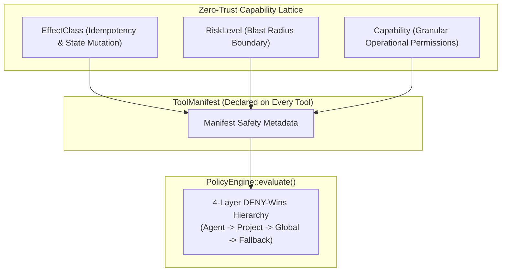
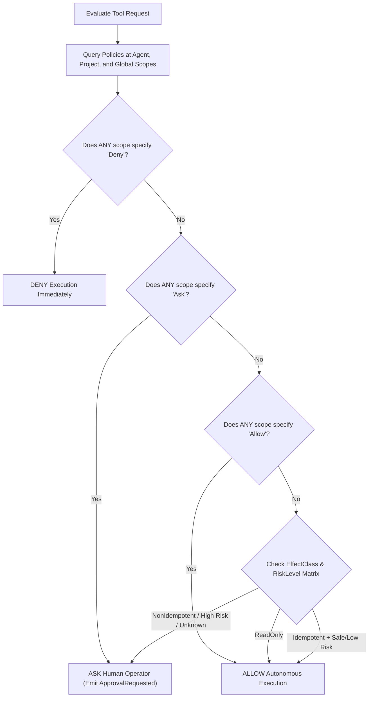
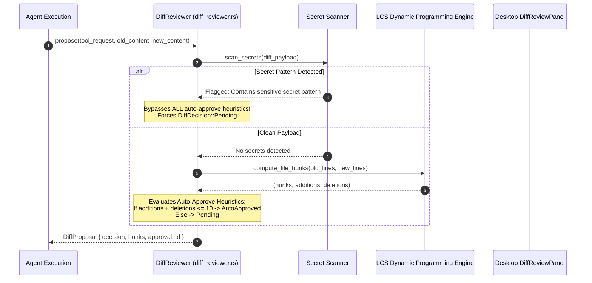
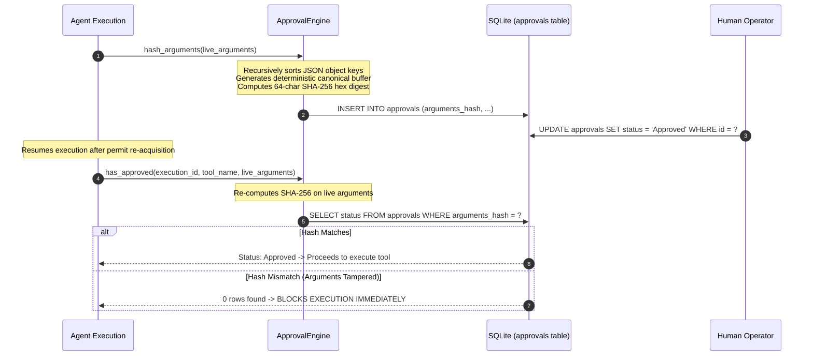
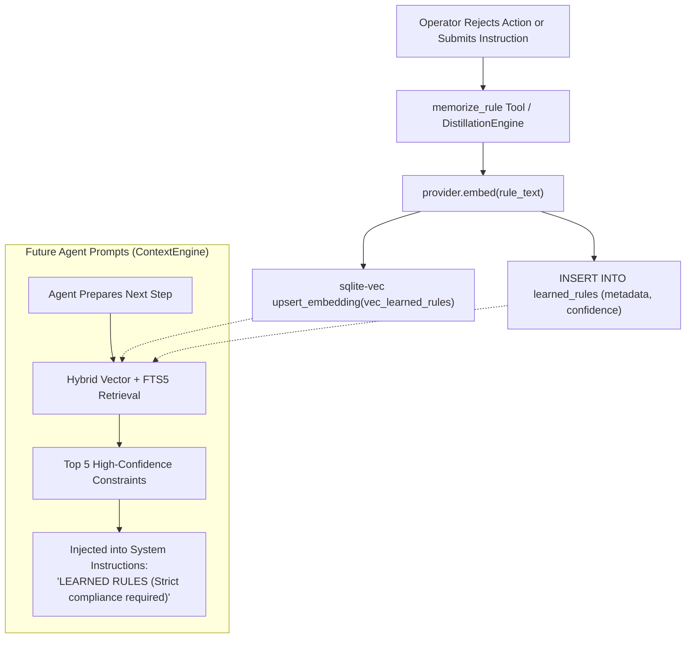

# Zero-Trust Governance & Security Policy Architecture

This document covers the implementation of the Trans4mers zero-trust governance layer: the capability lattice, diff review engine, anti-TOCTOU argument hashing, advisory file locks, and procedural rule distillation.

---

## 1. The Zero-Trust Capability Lattice

Trans4mers enforces authorization using a 3-dimensional safety lattice declared in `core/trans4mers-domain/src/tool.rs` and `policy.rs`:



### 1.1 `EffectClass` (Mathematical Side-Effect Classification)
```rust
#[derive(Debug, Clone, Copy, PartialEq, Eq, Serialize, Deserialize, strum::Display, strum::EnumString)]
pub enum EffectClass {
    ReadOnly,
    IdempotentMutation { requires_idempotency_key: bool },
    NonIdempotentMutation,
    Unknown,
}
```
- `ReadOnly`: causes no side-effects on external state ($S' = S$). Safe for autonomous execution (for example: `filesystem.read`, `git.status`, `memory.search`).
- `IdempotentMutation`: executing the tool multiple times with identical arguments yields the same state as executing it once ($f(f(x)) = f(x)$) (for example: `filesystem.write`, `memory.insert`).
- `NonIdempotentMutation`: mutates state cumulatively ($f(f(x)) \neq f(x)$) (for example: `terminal.execute`, `git.push`, `complete_task`).
- `Unknown`: untrusted or unclassified third-party plugin or MCP tool. Always forces human review (`Ask`).

### 1.2 `RiskLevel` (Potential Blast Radius)
```rust
#[derive(Debug, Clone, Copy, PartialEq, Eq, Serialize, Deserialize, strum::Display, strum::EnumString)]
pub enum RiskLevel {
    Safe,     // Zero side effects (read operations)
    Low,      // Reversible side effects (write to workspace scratch file)
    Medium,   // Significant side effects (run compilation command, git commit)
    High,     // Dangerous (git push, network requests, modify system settings)
    Critical, // Potentially destructive (delete files, terminate executions)
}
```

### 1.3 `Capability` (Granular Permission Lattice)
Every tool declares its required capabilities in its manifest:
- `FilesystemRead`, `FilesystemWrite`
- `ShellExecute`
- `GitRead`, `GitWrite`, `GitPush`
- `BrowserNavigate`, `BrowserInteract`
- `NetworkRequest`
- `MemoryRead`, `MemoryWrite`
- `AgentSpawn`, `AgentMessage`
- `SecretRead`
- `MemorizeRule`
- `Custom(String)`

---

## 2. Policy Evaluation Algorithm & Precedence Hierarchy (`policy_engine.rs`)

The evaluation engine executes a strict **DENY-wins multi-layer hierarchy**:



### Precedence Invariants

1. **Explicit Deny**: if any scope (agent, project, or global) evaluates to `Deny`, the request is denied immediately. No lower-level rule or permission can override a `Deny`.
2. **Operator Review**: if no scope denied the request but any scope specifies `Ask`, the engine pauses execution and emits an approval request.
3. **Explicit Allow**: if no scope denied or asked, and an active scope explicitly grants `Allow`, the tool executes autonomously.
4. **Fallback Evaluation**: if no policy rules match, the engine falls back to the tool's intrinsic `EffectClass` and `RiskLevel`. Any mutation above `Low` risk or with an `Unknown` effect class requires human approval.

---

## 3. DiffReviewer: LCS Algorithm & Secret Scanning (`diff_reviewer.rs`)

Before any file write or state mutation executes, `DiffReviewer` computes a unified diff and executes security heuristic scans:



### 3.1 Longest Common Subsequence (LCS) Dynamic Programming
File diffs are computed using a 2D dynamic programming matrix:
$$\mathrm{dp}[i][j] = \begin{cases} \mathrm{dp}[i-1][j-1] + 1 & \text{if } \mathrm{old}[i-1] == \mathrm{new}[j-1] \\ \max(\mathrm{dp}[i-1][j], \mathrm{dp}[i][j-1]) & \text{otherwise} \end{cases}$$

Backtracking from $(n, m)$ to $(0, 0)$ generates unified hunks formatted with canonical headers (`@@ -1,n +1,m @@`), counting additions and deletions line by line.

### 3.2 Secret Scanning Pattern Detection
Every diff payload is matched against configurable secret patterns (`force_review_secret_patterns`):
- `password=`
- `api_key=`
- `sk_live_`
- `BEGIN PRIVATE KEY` / `BEGIN RSA PRIVATE KEY`
- `aws_secret=`
- `stripe_`
- `ghp_`

> [!CAUTION]
> **Hard Security Invariant**: If any secret pattern is matched, all auto-approve rules are discarded immediately. The proposal is locked to `Pending` requiring mandatory human sign-off.

---

## 4. Canonical SHA-256 Hashing & Anti-TOCTOU Verification (`approval_engine.rs`)

To prevent Time-of-Check to Time-of-Use (TOCTOU) exploits where an agent modifies its payload between operator approval and tool execution:



### Canonical JSON Key Sorting
To guarantee identical hashes across different JSON engines:
1. All JSON object keys are collected into a vector and sorted lexicographically.
2. Values are recursively normalized and serialized without non-essential whitespace:
   $$\mathrm{CanonicalBuffer} = \texttt{\{"a":1,"b":true,"c":\["x","y"\]\}}$$
3. A pure-Rust SHA-256 block digest computes a 64-character hexadecimal digest written to `approvals.arguments_hash`.

---

## 5. Approval Lifecycle & Non-Blocking Permit Yielding

```mermaid
stateDiagram-v2
    [*] --> Pending: Agent hits PolicyOutcome::Ask
    Pending --> PermitYield: Drop concurrency permit (Semaphore slot freed)
    PermitYield --> AwaitingResolution: EventBus broadcast (ApprovalRequested)
    
    AwaitingResolution --> Approved: Operator clicks "Approve"
    AwaitingResolution --> Rejected: Operator clicks "Reject"
    AwaitingResolution --> Expired: 24h TTL elapsed without action

    Approved --> PermitReacquire: Scheduler::acquire_permit()
    PermitReacquire --> VerifiedExecute: Anti-TOCTOU hash verified & execute tool
    Rejected --> PermitReacquire: Step marked with ApprovalDenied
    Expired --> Terminated: Execution cancelled
    VerifiedExecute --> [*]
    Terminated --> [*]
```

### Non-Blocking Scheduling Guarantee
When an agent requests human approval:
- It calls `drop(current_permit.take())`.
- This immediately releases its semaphore slot back to the `Scheduler`, ensuring other background agents continue executing without worker pool exhaustion.
- Once the operator resolves the approval, the agent calls `app_state.scheduler.acquire_permit().await` before continuing.

---

## 6. Advisory File Lease Locks (`lock_repo.rs`)

To prevent multiple concurrent agents from clobbering the same file on disk, Trans4mers implements atomic SQLite leases:

```sql
-- Schema from M002__locks_and_approvals.sql
CREATE TABLE IF NOT EXISTS locks (
    id TEXT PRIMARY KEY,
    lock_key TEXT NOT NULL UNIQUE,
    holder TEXT NOT NULL,
    expires_at DATETIME NOT NULL,
    created_at DATETIME NOT NULL DEFAULT CURRENT_TIMESTAMP
);
CREATE INDEX IF NOT EXISTS idx_locks_key ON locks(lock_key, expires_at);
```

### Atomic Lease Acquisition Algorithm
```rust
pub fn try_acquire(&self, key: &str, holder: &str, ttl_secs: i64) -> Result<bool, Trans4mersError> {
    self.db.with_write_tx(|tx| {
        let now = Utc::now().to_rfc3339();
        let expires_at = (Utc::now() + chrono::Duration::seconds(ttl_secs)).to_rfc3339();

        // 1. Purge expired leases
        tx.execute("DELETE FROM locks WHERE expires_at < ?1", params![now])?;

        // 2. Atomic insert or extend existing holder lease
        let n = tx.execute(
            "INSERT INTO locks (id, lock_key, holder, expires_at, created_at)
             VALUES (?1, ?2, ?3, ?4, ?5)
             ON CONFLICT(lock_key) DO UPDATE SET expires_at = excluded.expires_at
             WHERE locks.holder = excluded.holder",
            params![uuid::Uuid::new_v4().to_string(), key, holder, expires_at, now],
        )?;

        Ok(n > 0)
    })
}
```
- **Lock Key Pattern**: `file:{project_id}:{relative_file_path}`
- **Default TTL**: 60 seconds (automatically refreshed during long write operations).
- **Conflict Handling**: If another agent holds an unexpired lease, `n == 0`, returning `false`. The calling agent yields or backs off.

---

## 7. Procedural Rule Distillation ("Teach Rule")

When a human operator rejects a proposal or corrects an agent's approach, that correction is codified as a permanent constraint:



### Invariant Guarantee
Distilled rules are stored in procedural memory and retrieved using **Hybrid Reciprocal Rank Fusion (RRF)** on every subsequent agent step. The agent cannot un-learn or discard high-confidence rules without administrative database modification.
