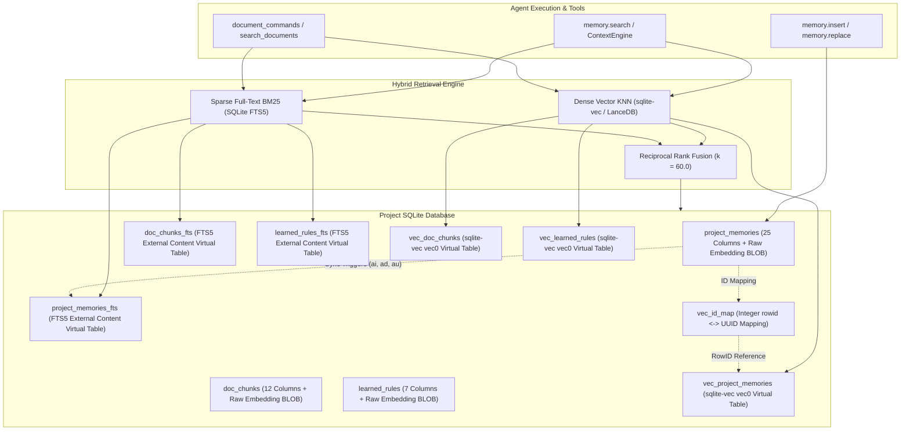
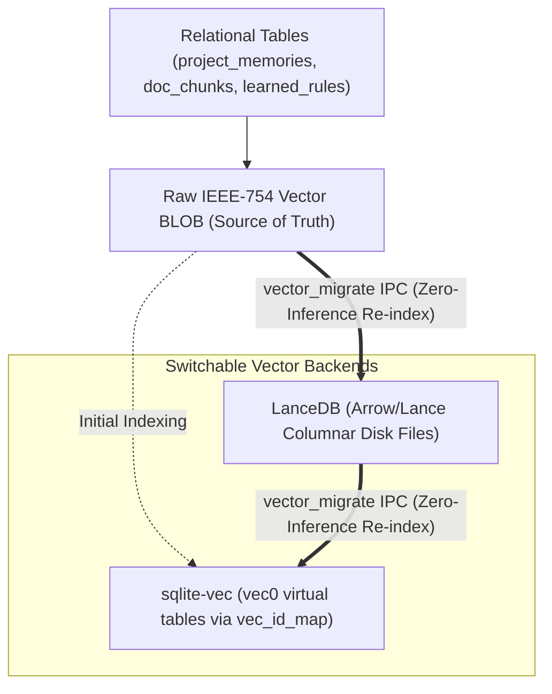
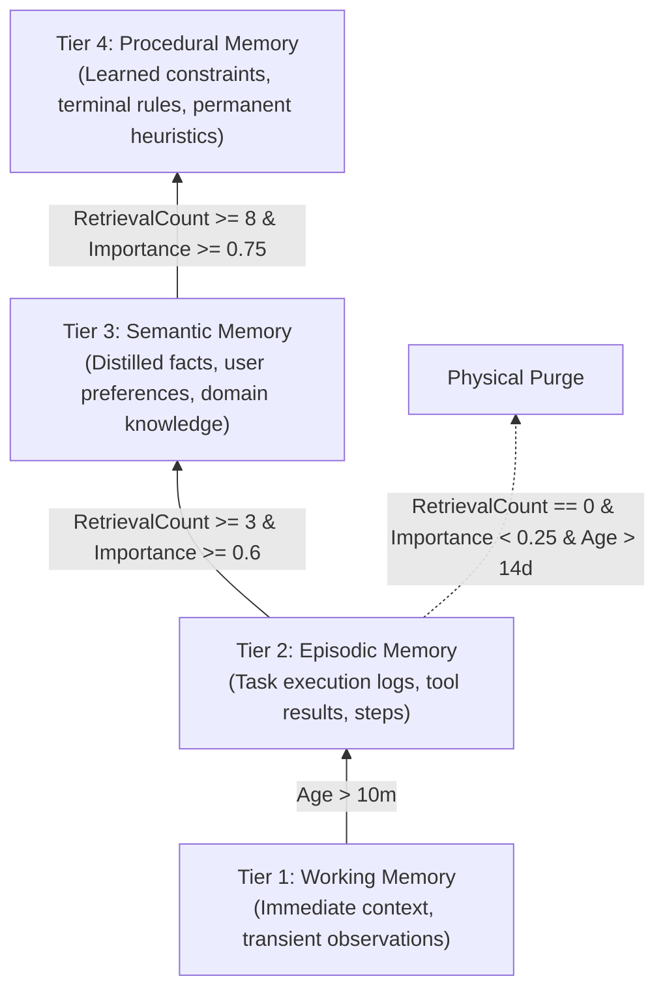

# Memory, Cognitive Pyramid & Hybrid RAG Architecture

This document covers the implementation of the Trans4mers memory subsystem: the four-tier cognitive pyramid, vector serialization, hybrid Reciprocal Rank Fusion (RRF), Okapi BM25 ranking, document chunking, and background consolidation.

---

## 1. Architectural Overview & Storage Topology

Trans4mers separates persistent state across two database tiers:
- The global database (`global.sqlite`) stores system configuration, provider credentials in the OS keyring, the project registry, global agent definitions, and cross-project policies.
- The project database (`.trans4mers/project.sqlite`) stores workspace events, conversations, agent executions, the four-tier cognitive memory pyramid, document chunks, and vector index tables.



---

## 2. Physical Database Schema & Indexes

### 2.1 Table `project_memories`
The primary relational store for agent memories (25 physical columns):

| Column | Type | Description |
| :--- | :--- | :--- |
| `id` | `TEXT PRIMARY KEY` | UUID string identifier. |
| `project_id` | `TEXT NOT NULL` | Owning project reference. |
| `conversation_id` | `TEXT` | Optional conversation context reference. |
| `agent_instance_id`| `TEXT` | Optional creating agent reference. |
| `scope` | `TEXT NOT NULL` | `'Global' \| 'Project' \| 'Conversation' \| 'Agent' \| 'Ephemeral' \| 'Artifact'` |
| `lifecycle` | `TEXT NOT NULL` | `'Observation' \| 'Candidate' \| 'Validated' \| 'Persisted' \| 'Rejected'` |
| `content` | `TEXT NOT NULL` | Raw memory text. |
| `importance` | `REAL NOT NULL` | Float score ($0.0$ to $1.0$). |
| `confidence` | `REAL NOT NULL` | Float confidence metric ($0.0$ to $1.0$). |
| `provenance` | `TEXT NOT NULL` | JSON serialized source event, message, and agent metadata. |
| `depth_level` | `INTEGER NOT NULL` | Agent delegation hierarchy depth. |
| `tier` | `TEXT NOT NULL` | `'Working' \| 'Episodic' \| 'Semantic' \| 'Procedural'` (default: `'Working'`). |
| `retrieval_count` | `INTEGER NOT NULL` | Reinforcement counter incremented on retrieval. |
| `last_retrieved_at`| `DATETIME` | RFC3339 timestamp of most recent query hit. |
| `expires_at` | `DATETIME` | Optional TTL expiration timestamp. |
| `visibility_overrides`| `TEXT` | JSON array of actor IDs with exceptional access. |
| `valid_from` / `valid_until` | `DATETIME` | Bi-temporal validity bounds. |
| `created_at` / `updated_at` | `DATETIME NOT NULL`| Creation and mutation audit timestamps. |
| `embedding` | `BLOB` | IEEE-754 little-endian binary vector embedding. |
| `valid_at` / `invalid_at` | `DATETIME` | Temporal validity start and non-destructive retirement timestamp. |
| `replaced_by` | `TEXT` | UUID of superseding memory record when updated. |
| `content_hash` | `TEXT` | SHA-256 hex digest of `content.trim().to_lowercase()`. |

**Indexes**:
- `idx_memories_tier`: `ON project_memories(project_id, tier, importance)`
- `idx_memories_temporal`: `ON project_memories(project_id, valid_at, invalid_at)`
- `idx_memories_content_hash`: `ON project_memories(project_id, content_hash)`

### 2.2 Virtual FTS5 External Content Tables & Sync Triggers
SQLite FTS5 virtual tables maintain full-text indices without duplicating string content:
```sql
CREATE VIRTUAL TABLE IF NOT EXISTS project_memories_fts USING fts5(
    content,
    content='project_memories',
    content_rowid='rowid'
);
```
Automated SQLite triggers keep the index synchronized:
- `AFTER INSERT`: Inserts new `(rowid, content)` into `project_memories_fts`.
- `AFTER DELETE`: Deletes old `(rowid, content)` using `fts5('delete', ...)`.
- `AFTER UPDATE`: Atomically executes delete of old row followed by insert of new row.

Identical trigger architectures exist for `doc_chunks_fts` (indexing `doc_chunks.text`) and `learned_rules_fts` (indexing `learned_rules.rule_text`).

---

## 3. Vector Serialization & Dual-Store Migration Architecture

### 3.1 Binary Vector Layout (`vector_blob.rs`)
Embeddings are serialized as contiguous arrays of little-endian IEEE-754 32-bit single-precision floats:
- **Serialization**:
  $$\mathrm{ByteSize} = 4 \times D \quad (\text{e.g. } 768 \text{ dimensions} = 3,072 \text{ bytes})$$
  ```rust
  pub fn embedding_to_blob(embedding: &[f32]) -> Vec<u8> {
      let mut bytes = Vec::with_capacity(embedding.len() * 4);
      for &f in embedding {
          bytes.extend_from_slice(&f.to_le_bytes());
      }
      bytes
  }
  ```
- **Deserialization**:
  ```rust
  pub fn blob_to_embedding(blob: &[u8]) -> Vec<f32> {
      blob.as_chunks::<4>().0.iter().map(|&c| f32::from_le_bytes(c)).collect()
  }
  ```

### 3.2 Dual Storage & Zero-Inference Migration Engine (`vector_migration.rs`)
The relational `embedding BLOB` column acts as the single source of truth. Vector index backends (`sqlite-vec` or `LanceDB`) are treated as derived projections:



When an operator or project switches vector backends via `vector_migrate(project_id, target_backend)`:
1. The migration runner reads all stored vector BLOBs directly from SQLite (`load_all_doc_chunk_embeddings`, `load_all_memory_embeddings`, `load_all_rule_embeddings`).
2. It batch-upserts the deserialized `Vec<f32>` arrays into the destination backend.
3. It verifies record count parity between source and destination tables.
4. It updates `project_settings.vector_backend`.
5. **No external LLM inference is triggered**, incurring zero financial cost and completing in milliseconds.

---

## 4. The 4-Tier Cognitive Memory Pyramid

Trans4mers implements a tiered cognitive memory architecture with automatic promotion and stale pruning (`core/trans4mers-engine/src/memory_tier_promoter.rs`):



### Promotion Rules Matrix
| Transition | Trigger Criteria | Action |
| :--- | :--- | :--- |
| **Working $\to$ Episodic** | $\mathrm{tier} = \text{'Working'} \land \mathrm{age} > 10\text{ minutes}$ | Promotes tier to `'Episodic'`, updates `updated_at`. |
| **Episodic $\to$ Semantic** | $\mathrm{tier} = \text{'Episodic'} \land \mathrm{retrievals} \ge 3 \land \mathrm{importance} \ge 0.6$ | Promotes tier to `'Semantic'`. |
| **Semantic $\to$ Procedural**| $\mathrm{tier} = \text{'Semantic'} \land (\mathrm{retrievals} \ge 8 \lor \mathrm{depth} \ge 2) \land \mathrm{importance} \ge 0.75$ | Promotes tier to `'Procedural'`. |
| **Episodic Pruning** | $\mathrm{tier} = \text{'Episodic'} \land \mathrm{retrievals} == 0 \land \mathrm{importance} < 0.25 \land \mathrm{age} > 14\text{ days}$ | Physically purges record from `project_memories`. |

---

## 5. Hybrid Retrieval: Mathematics of RRF and BM25

When querying memory or workspace documents, Trans4mers combines dense semantic vector matching with sparse lexical matching using **Reciprocal Rank Fusion (RRF)**:

### 5.1 Reciprocal Rank Fusion Formula (`rrf.rs`)
$$\mathrm{RRF\_Score}(d) = \sum_{l \in \mathcal{L}} \frac{1.0}{k + \mathrm{rank}_l(d)}$$
- Constant: $k = 60.0$
- Ranks are 0-indexed: $\mathrm{rank} \in [0, N-1]$
- A top match ($\mathrm{rank} = 0$) in both dense and sparse retrieval receives:
  $$\mathrm{Score} = \frac{1.0}{60.0 + 0} + \frac{1.0}{60.0 + 0} = \frac{1}{30} \approx 0.033333$$

### 5.2 Okapi BM25 Ranking (`bm25.rs`)
For lexical relevance, the engine uses the Okapi BM25 algorithm with Robertson-Spärck Jones Inverse Document Frequency (IDF):
$$\mathrm{IDF}(t) = \max\left(0.0, \, \ln\left(1.0 + \frac{N - \mathrm{df}(t) + 0.5}{\mathrm{df}(t) + 0.5}\right)\right)$$

$$\mathrm{BM25}(D, Q) = \sum_{t \in Q} \mathrm{IDF}(t) \cdot \frac{\mathrm{tf}(t, D) \cdot (k_1 + 1)}{\mathrm{tf}(t, D) + k_1 \cdot \left(1 - b + b \cdot \frac{|D|}{\mathrm{avgdl}}\right)}$$
- Parameters: $k_1 = 1.2$, $b = 0.75$
- $\mathrm{avgdl}$: Average document token length across the indexed collection.

### 5.3 Dense Distance Normalization
Dense vector search distances ($L_2$ or cosine) are normalized into the range $(0.0, 1.0]$ via:
$$\mathrm{Score}_{\mathrm{dense}} = \frac{1.0}{1.0 + \max(0.0, \mathrm{distance})}$$

---

## 6. Document Chunking & Ingestion Engine (`document_chunker.rs`)

### 6.1 Chunking Strategy by Extension
- Markdown files (`.md`, `.markdown`, `.mdx`): split on headings (`# `, `## `, `### `, `#### `) with an 80-token minimum before a split and an 800-token ceiling.
- Source code files (`.rs`, `.py`, `.ts`, `.go`, `.java`, etc.): split on top-level function and type declarations (`fn `, `def `, `class `, `struct `, `impl `, `trait `) with a 60-token minimum and 750-token ceiling.
- Plain text and other extensions: split on blank lines with a 100-token minimum and 600-token ceiling.

### 6.2 Token Estimation & Sliding Window
- Token counting uses BPE tokenization via `tiktoken_rs::cl100k_base()`, with a heuristic character fallback (`chars / 4`).
- `DocumentChunker` uses non-overlapping partitions (`current_chunk_lines.clear()`), meaning sliding window overlap is zero tokens.

### 6.3 Incremental Deduplication
1. Computes SHA-256 digest of whole file content.
2. Checks `doc_ingest_state`: If `content_hash` matches and `chunk_count > 0`, re-indexing is bypassed entirely.
3. If file was modified, existing chunks are deleted from `doc_chunks` and `vec_doc_chunks` before new chunks are inserted.

---

## 7. Background Consolidation: Nightly Dreaming & Distillation

### 7.1 Nightly Dreaming (`nightly_dreaming.rs`)
- The dreaming worker evaluates hourly and triggers at 3:00 AM local time when enabled.
- It requires local Ollama (`qwen2.5-coder:3b`) or an explicit custom model configuration. If Ollama is offline and no custom model is configured, the worker halts immediately to avoid unbudgeted cloud API charges.
- It scans conversations from the past 24 hours, prompts the model to extract reusable heuristics, and saves new entries into `learned_rules`.

### 7.2 Cognitive Distillation Engine (`distillation_engine.rs`)
- The distillation engine runs every 60 seconds inside the housekeeping loop.
- Progress is tracked through `conversation_distillation_markers`. It checks for conversations with new messages after `last_distilled_at` where conversation inactivity exceeds 30 seconds.
- The model extracts facts, deduplicates them by SHA-256 `content_hash`, and bumps the importance score (+0.1) when recurring facts are seen.

---

## 8. Reverse-Engineered Auditing Findings & Limitations

Under the brutal honesty rule of `GEMINI.md`, the audit identified the following verified implementation characteristics:

1. The distillation engine writes new memories with lifecycle status `'Candidate'`, while retrieval queries in `memory_engine.rs` filter on `m.lifecycle = 'Persisted'`. Memories remain candidates until explicitly validated.
2. When `memory_tier_promoter.rs` purges stale episodic memories, it executes `DELETE FROM project_memories`. SQLite handles the relational deletion, and vector store indices update on the next re-indexing cycle.
3. The nightly dreaming worker inserts rules into `learned_rules`, triggering SQLite triggers that immediately populate `learned_rules_fts`. Lexical search is instantly available, while dense vector representations are generated on subsequent vector re-indexing.
4. The global database maintains separate `global_memories` and `global_memories_fts` tables for system-wide knowledge, while project-specific memories remain isolated in their respective project databases.
