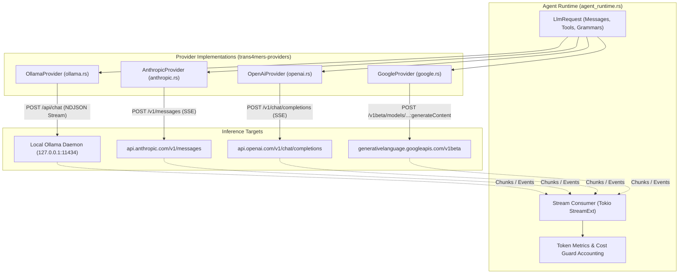
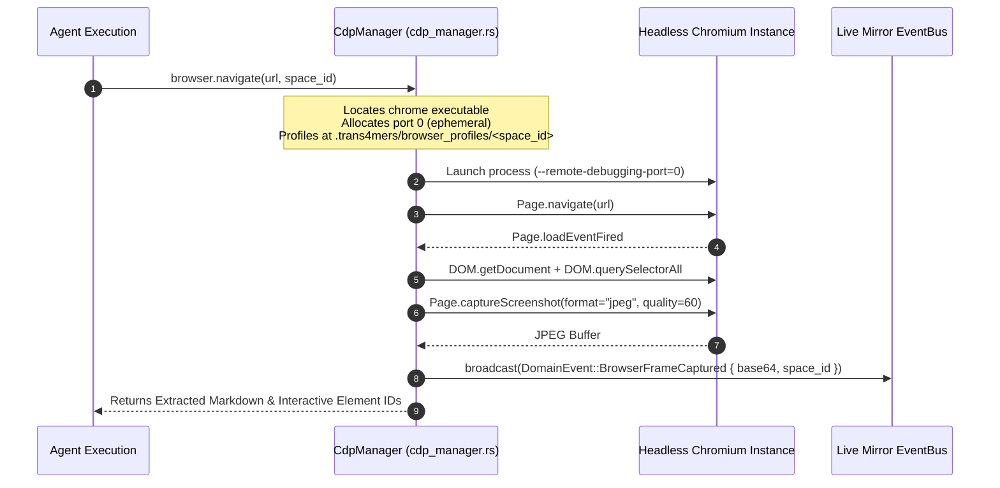
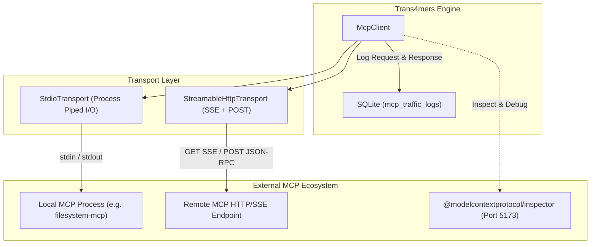
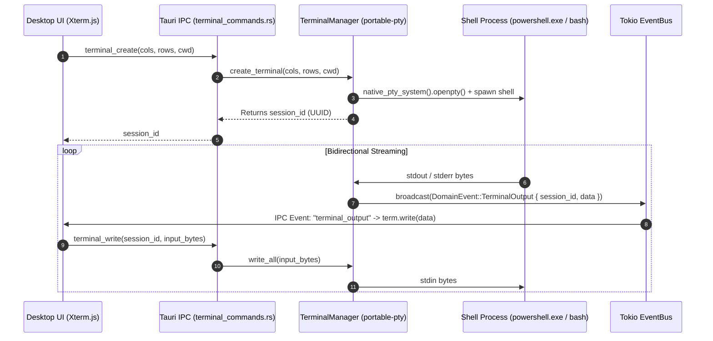

# External Protocols, Inference & Native Tooling Architecture

This document details the external integration layer in Trans4mers: LLM provider streaming and tool mapping, the Model Context Protocol (MCP) host, Chrome DevTools Protocol (CDP) browser spaces, native pseudo-terminals (PTY), and built-in execution tools.

---

## 1. LLM Provider Subsystem & Streaming Pipeline

Trans4mers abstracts model inference behind the asynchronous [`LlmProvider`](../../core/trans4mers-domain/src/provider.rs) trait in `trans4mers-domain`:

```rust
#[async_trait]
pub trait LlmProvider: Send + Sync {
    async fn generate(&self, request: &LlmRequest) -> Result<LlmResponse, Trans4mersError>;
    async fn generate_stream(
        &self,
        request: &LlmRequest,
    ) -> Result<Pin<Box<dyn Stream<Item = Result<LlmStreamEvent, Trans4mersError>> + Send>>, Trans4mersError> {
        // Fallback default implementation
        let response = self.generate(request).await?;
        Ok(Box::pin(futures::stream::iter(vec![
            Ok(LlmStreamEvent::TextDelta(response.content)),
            Ok(LlmStreamEvent::Usage(response.metrics)),
            Ok(LlmStreamEvent::Finish),
        ])))
    }
    async fn embed(&self, text: &str, model: &ModelConfig) -> Result<Vec<f32>, Trans4mersError>;
}
```



### Provider Implementations & Notes

1. [`OllamaProvider`](../../core/trans4mers-providers/src/llm/ollama.rs) streams newline-delimited JSON (`NDJSON`) from `POST /api/chat`. It unpacks `message.tool_calls` and emits `LlmStreamEvent::ToolCallDelta`. When tools are provided, Ollama does not accept a strict JSON schema alongside them; tool definitions are passed in the `tools` array. For zero-egress environments, `OllamaModelDetector` reads local manifests directly from `~/.ollama/models/manifests` without network requests, and rejects non-loopback IPs.

2. [`AnthropicProvider`](../../core/trans4mers-providers/src/llm/anthropic.rs) uses Server-Sent Events (`text/event-stream`), unpacking `content_block_delta` for text and `message_delta` for token usage. In `anthropic.rs`, streaming does not assemble partial tool-call deltas. When tools are invoked, the provider switches to non-streaming `generate()` to deserialize complete tool-call blocks.

3. [`OpenAiProvider`](../../core/trans4mers-providers/src/llm/openai.rs) streams SSE events terminating with `data: [DONE]`. It accumulates indexed tool call chunks across argument fragments until complete.

4. [`GoogleProvider`](../../core/trans4mers-providers/src/llm/google.rs) does not implement native SSE streaming (`streamGenerateContent`). It uses the trait fallback, awaiting the complete `generate()` response and emitting synthetic chunks. Tool definitions are passed via `functionDeclarations`.

---

## 2. CDP Browser Spaces & Live Mirror Subsystem

Trans4mers implements browser automation via direct Chrome DevTools Protocol (CDP) control using `chromiumoxide` in `core/trans4mers-providers/src/browser/`:



### Browser Isolation & Security Invariants
1. **Isolated User Data Directories**:
   - Each browser space is sandboxed to a physical directory: `.trans4mers/browser_profiles/{space_id}/`.
   - Cookies, local storage, session storage, and cache partitions are strictly segregated between spaces.
2. **Deterministic Rollback Snapshots**:
   - Before stateful interactions, `CdpManager` computes a SHA-256 Merkle tree of `.trans4mers/browser_profiles/{space_id}/` and archives it to `.trans4mers/browser_snapshots/{snapshot_id}/`.
   - Rollback operations completely terminate the Chromium process, restore the snapshot tree, and re-launch.
3. **Session Auth Injection (`auth_injector.rs`)**:
   - Injects authentication tokens, custom HTTP request headers, and initial cookies via CDP `Network.setCookies` and `Network.setExtraHTTPHeaders` before navigation begins.
4. **Markdown Extraction & Length Caps (`markdown_extractor.rs`)**:
   - Strips `<script>`, `<style>`, `<noscript>`, and SVG payloads.
   - Extracts semantic text and maps clickable elements to numbered reference IDs (e.g. `[Click: #submit-btn]`).
   - Hard cap: Output text is capped at exactly 16,000 characters to prevent context window saturation.

---

## 3. Model Context Protocol (MCP) Subsystem

Trans4mers acts as an enterprise Model Context Protocol (MCP) host, implementing client connections to external MCP servers across multiple transports (`core/trans4mers-providers/src/mcp_client.rs`):



### Protocol Details
- **`StdioTransport`**: Spawns external binaries (e.g. `npx -y @modelcontextprotocol/server-filesystem`) via `tokio::process::Command` with piped `stdin` and `stdout`. Sends framed JSON-RPC 2.0 messages separated by newlines.
- **`StreamableHttpTransport`**: Implements SSE connection for incoming events and HTTP POST for outgoing requests. Employs origin verification and loopback/private IP guards to prevent DNS rebinding and SSRF attacks.
- **Audit Logging**: Every outgoing JSON-RPC request and incoming response/error is persisted to the `mcp_traffic_logs` table in the project database, providing full auditing of all external agent interactions.
- **Official MCP Inspector**: The desktop app can launch the official `@modelcontextprotocol/inspector` on port 5173 via `mcp_inspector.rs` for live protocol debugging.

---

## 4. Pseudo-Terminal (PTY) Subsystem

Trans4mers provides interactive, duplex terminal sessions for agent and human execution via native PTY bindings (`core/trans4mers-engine/src/terminal_manager.rs`):



### PTY Specifications
- **Underlying Engine**: `portable-pty` crate with native WinPTY/ConPTY backend on Windows and OpenPTY on Linux/macOS.
- **Shell Resolution**: Spawns `powershell.exe` on Windows (`cmd.exe` fallback) and `$SHELL` (or `/bin/bash`) on Unix platforms.
- **Async Threading**: Spawns dedicated Tokio blocking reader threads per active terminal that pump bytes from the PTY master into `EventBus` broadcasts (`DomainEvent::TerminalOutput`).
- **Resize Handling**: Supports dynamic PTY dimensions via `terminal_resize(session_id, cols, rows)`.

---

## 5. Complete Catalog of 25 Native Built-in Tools

Every native tool in Trans4mers is registered in `ToolExecutor` (`core/trans4mers-engine/src/native_tools.rs`, `delegate_task.rs`, and `complete_task.rs`):

| # | Tool Name | Effect Class | Primary Parameters | Description |
| :--- | :--- | :--- | :--- | :--- |
| 1 | `filesystem.read` | `ReadOnly` | `path: String`, `offset: Option<u64>`, `length: Option<u64>` | Reads file contents with UTF-8 decoding and size checks. |
| 2 | `filesystem.write` | `WorktreeState` | `path: String`, `content: String`, `create_directories: bool` | Writes file to disk. Triggers `DiffReviewer` diff tracking. |
| 3 | `filesystem.list` | `ReadOnly` | `path: String`, `recursive: bool`, `max_depth: Option<usize>` | Lists directory contents with file metadata. |
| 4 | `filesystem.delete` | `WorktreeState` | `path: String`, `recursive: bool` | Deletes file or directory. Triggers policy approval if outside scratch. |
| 5 | `filesystem.diff` | `ReadOnly` | `path: String`, `staged: bool` | Generates unified diff of changes against base git commit. |
| 6 | `git.status` | `ReadOnly` | `repo_path: Option<String>` | Returns git branch, clean/dirty state, and untracked files. |
| 7 | `git.commit` | `WorktreeState` | `message: String`, `all: bool` | Stages changes and records a git commit in the agent worktree. |
| 8 | `git.diff` | `ReadOnly` | `target: Option<String>`, `cached: bool` | Returns unified diff against specified ref or staging area. |
| 9 | `git.log` | `ReadOnly` | `max_count: Option<usize>` | Returns sequential commit log with SHA, author, and commit message. |
| 10 | `git.branch` | `WorktreeState` | `name: String`, `checkout: bool` | Creates or switches git branches in the local repository. |
| 11 | `terminal.execute` | `SystemState` | `command: String`, `timeout_seconds: Option<u64>` | Executes a command synchronously in a subshell and returns stdout/stderr. |
| 12 | `terminal.write` | `SystemState` | `session_id: String`, `data: String` | Writes input keystrokes or data into an active PTY session. |
| 13 | `terminal.resize` | `ReadOnly` | `session_id: String`, `cols: u16`, `rows: u16` | Resizes active PTY terminal buffer dimensions. |
| 14 | `browser.navigate`| `NetworkExternal`| `url: String`, `space_id: String` | Navigates CDP browser space to target URL and captures DOM state. |
| 15 | `browser.click` | `NetworkExternal`| `space_id: String`, `selector: Option<String>`, `element_id: Option<u32>` | Clicks DOM element by CSS selector or mapped index ID. |
| 16 | `browser.type` | `NetworkExternal`| `space_id: String`, `selector: String`, `text: String`, `press_enter: bool` | Enters keystrokes into input elements via CDP Input domain. |
| 17 | `browser.screenshot`| `ReadOnly` | `space_id: String`, `full_page: bool` | Captures JPEG screenshot of current viewport. |
| 18 | `browser.eval` | `NetworkExternal`| `space_id: String`, `expression: String` | Evaluates raw JavaScript expression inside page execution context. |
| 19 | `memory.search` | `ReadOnly` | `query: String`, `tier: Option<String>`, `limit: Option<usize>` | Performs hybrid vector + FTS5 search across agent memory tiers. |
| 20 | `memory.insert` | `AgentState` | `tier: String`, `content: String`, `metadata: Option<Value>` | Persists new memory entry into Working, Episodic, or Semantic store. |
| 21 | `memory.replace` | `AgentState` | `memory_id: String`, `new_content: String` | Replaces existing memory content and re-indexes vector embeddings. |
| 22 | `memory.archive` | `AgentState` | `memory_id: String` | Marks memory as archived, excluding it from active retrieval queries. |
| 23 | `mcp.call_tool` | `NetworkExternal`| `server_id: String`, `tool_name: String`, `arguments: Value` | Dispatches tool invocation across active Stdio or HTTP MCP transport. |
| 24 | `delegate_task` | `AgentState` | `instructions: String`, `role: Option<String>`, `capabilities: Option<Vec<String>>` | Dynamically spawns a specialist sub-agent in an isolated git worktree. |
| 25 | `complete_task` | `AgentState` | `summary: String`, `artifacts: Option<Vec<String>>` | Finalizes task, merges worktree branch, and notifies parent agent. |

---

## 6. Extensibility: Python Plugins & Declarative Skills

1. **Python JSON-RPC Plugin Runner (`plugin_runner.rs`)**:
   - Executes custom Python plugins in isolated subprocesses.
   - Communicates over `stdin`/`stdout` using framed JSON-RPC 2.0 requests.
   - Automatically injects workspace environment variables and enforces timeout terminations.

2. **Declarative Workflow Skills (`skill_loader.rs`)**:
   - Scans `.trans4mers/skills/` for TOML declarations (`skill.toml`).
   - Defines multi-step procedural skills with parameter types, preconditions, and chained subtool invocations.
   - Injected dynamically into system context prompt during context assembly.
